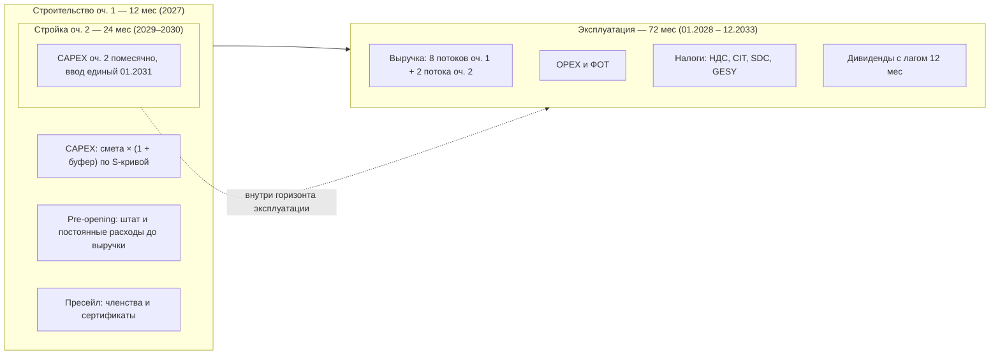
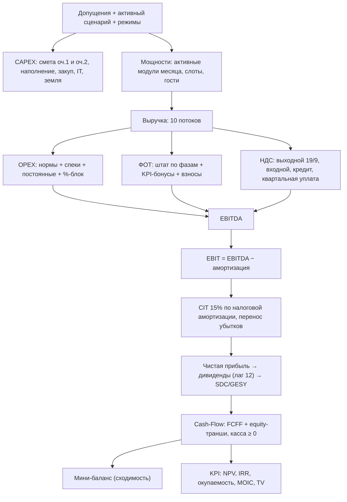
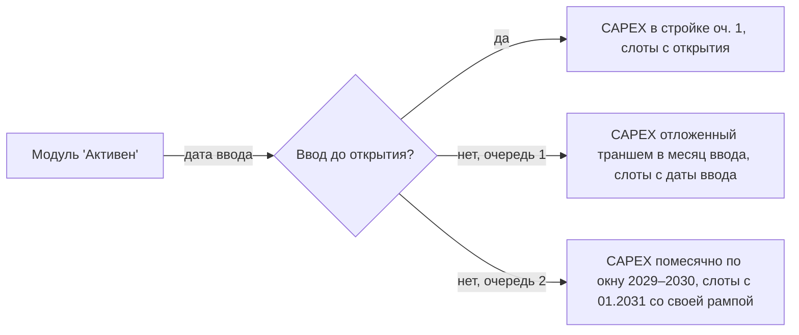
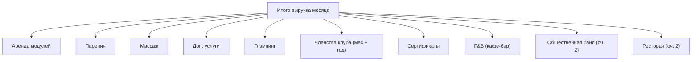
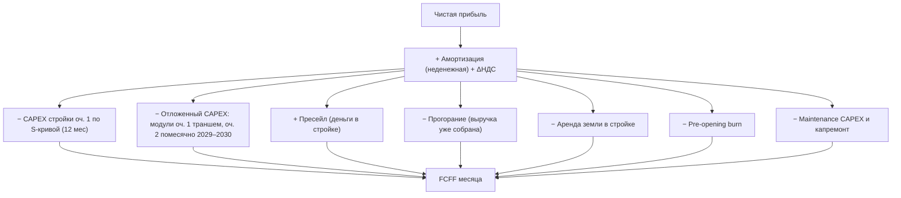

# Руководство по финансовой модели

Подробное описание принципов, допущений и формул финансовой модели
AURA HILLS — банного, SPA, wellness и глэмпинг-комплекса на Кипре,
строящегося в две очереди.

Модель помесячная: каждая метрика посчитана для каждого из **84 месяцев**
горизонта (12 месяцев стройки + 72 месяца эксплуатации) и может быть
проверена на любом шаге. Ядро расчёта — код (TypeScript), а не Excel:
допущения хранятся типизированным JSON, Excel-книга — выгрузка для
проверки и передачи, не источник истины.

## 1. Назначение модели

Модель отвечает на вопросы инвестиционного решения:

- Сколько денег нужно вложить и когда — **пиковая потребность в финансировании**
  и сумма **equity-траншей**;
- Когда проект вернёт деньги — **окупаемость и дисконтированная окупаемость**;
- Сколько проект заработает — **NPV, IRR, MOIC, cash-on-cash**;
- Насколько устойчив результат к ошибкам в допущениях —
  **анализ чувствительности, tornado и точка безубыточности**;
- Что будет, если спрос окажется ниже плана — **сценарии Conservative / Base / Aggressive**;
- Что даёт **вторая очередь** (общественная баня + 4 VIP-комплекса) и что
  будет при её частичной реализации — пообъектные выключатели.

## 2. Временная структура

Горизонт — стройка очереди 1 (12 мес) плюс операционка **72 месяца**:

Ключевые даты (`meta`): старт стройки `2027-01`, открытие `2028-01`,
`capexMonths = 12`, `opsMonths = 72`. Задержка стройки из сценария
сдвигает открытие и удлиняет стройку — при задержке 4 мес (Conservative)
CF становится 88 месяцев.

**Операционные годы.** Год 1 = 2028, … год 5 = 2032, год 6 = 2033.
Сценарные векторы заданы на пять лет; **шестой год повторяет пятый**
(загрузки, члены), но индексация цен и инфляция продолжают расти
($g_6 = (1+p)^5$). Так горизонт покрывает три года работы второй
очереди без искусственного «обрыва» в 2032.

Все денежные потоки учитываются в том месяце, когда они происходят.
Отложенные события — пресейл, активация модулей с поздним вводом,
отложенный CAPEX, стройка и ввод очереди 2 — привязаны к конкретным
месяцам, а не размазаны усреднённо. Вторая очередь строится «на фоне»
работающего проекта: её инвестиционный отток идёт в операционных месяцах
2029–2030 (месяцы CF 25–48), а выручка начинается с единой даты ввода
январь 2031 (раздел 21).

## 3. Логика расчёта

Расчёт выполняется одним последовательным проходом (`runModel`): результат
каждого шага — вход для следующего. Такой порядок исключает циклические
зависимости и делает каждую цифру воспроизводимой.

Налог на прибыль не зависит от чистой прибыли, поэтому первый проход даёт
корректный CIT; дивиденды берут чистую прибыль с лагом 12 месяцев —
второй проход считает их от реальной базы.

Все отчёты, Excel-выгрузка, публичный снимок для ИИ и Data Room считаются
одним и тем же ядром — расхождений между «цифрой в таблице» и «цифрой
в Excel» быть не может по построению.

## 4. Сценарии

### 4.1 Матрица сценариев

Три встроенных сценария задают траекторию спроса. Каждый сценарий — набор
годовых векторов (вкладка «Сценарии»):

| Параметр | Conservative | Base | Aggressive |
|---|---|---|---|
| Загрузка бань, год 1 → 5 | 35% → 60% | 50% → 75% | 65% → 90% |
| Загрузка парений, год 1 / 3 / 5 | 35 / 65 / 70% | 50 / 85 / 90% | 65 / 95 / 100% |
| Загрузка массажа, год 1 / 3 / 5 | 20 / 45 / 55% | 30 / 65 / 75% | 45 / 80 / 90% |
| Загрузка доп. услуг, год 1 / 3 / 5 | 10 / 40 / 45% | 25 / 60 / 65% | 40 / 70 / 75% |
| Загрузка глэмпинга, год 1 / 3 / 5 | 20 / 45 / 55% | 40 / 65 / 75% | 60 / 80 / 90% |
| Общественная баня (оч. 2), год 1 / 5 | 25% → 45% | 35% → 65% | 50% → 80% |
| Ресторан (оч. 2), год 1 / 5 | 25% → 50% | 35% → 65% | 50% → 85% |
| Месячных членов, год 1 / 3 / 5 | 20 / 70 / 99 | 50 / 120 / 170 | 80 / 180 / 255 |
| Доля реализации услуг (uptake) | 20% | 30% | 40% |
| Рост цен в год | +3% | +3% | +5% |
| Буфер CAPEX оч. 1 | +20% | +10% | +5% |
| Выход на план (ramp) | 12 мес | 9 мес | 6 мес |
| Задержка стройки | 4 мес | 1 мес | 0 |
| Множитель энергозатрат | ×1.3 | ×1.0 | ×0.9 |

Активный сценарий по умолчанию — **Base**; переключается в шапке
приложения и действует на всю модель разом.

Задержка стройки сдвигает дату открытия и удлиняет период CAPEX-графика:
аренда земли и pre-opening платятся дольше, первая выручка приходит позже;
фазы штата привязаны к календарю и не сдвигаются. Множитель энергозатрат
масштабирует статьи постоянных OPEX с флагом `energy` (электроэнергия,
отопление).

Загрузка услуг — отдельный вектор-множитель к доле реализации:
услуги живут в депозит-кошельке гостя и масштабируются слотами бань,
но реально берут включённую услугу не все — парения в год 1 берут
50% гостей Base-сценария, а не 100%. Переключатель «Пакетный режим»
задаёт базовую долю реализации (uptake): включён (`meta.mode` = «Да» —
текущая настройка) — услуга входит в слот и uptake = 100%; выключен —
берётся значение из строки «Доля реализации услуг». Итоговая доля
гостей с услугой = `uptake × загрузка услуги`.

Загрузки очереди 2 (`publicBath`, `restaurant`) — тоже годовые векторы
матрицы: это доля пропускной способности общественной бани и доля
занятости ресторана. Они начинают действовать только с даты ввода
очереди 2 (2031) — до неё потоки равны нулю при любых значениях.

Состав объектов очереди 2 (какие VIP построены, есть ли общественная
баня) — **не сценарный параметр**: это единое допущение для всех трёх
сценариев, задаётся тоглами в Допущениях.

### 4.2 Годовые векторы

Все потоки заданы **явно по пяти годам** в матрице сценариев —
интерполяций и унаследованных из Excel коэффициентов нет. Промежуточные
годы (2, 4, 5) редактируются так же, как явные годы 1 и 3, — через
строки «X — Год N» на вкладке «Сценарии». Год 6 берёт значения года 5.

Матрица сохраняется в браузере вместе с допущениями; кнопка «JSON»
выгружает всё состояние (допущения + матрица + номенклатура + спеки),
«Загрузить» — возвращает из файла.

## 5. Мощности и ограничения

### 5.1 Банные модули и слоты

В модели **семь банных модулей**: три стартовых (очередь 1) и четыре
VIP-комплекса (очередь 2). Каждый модуль продаёт время: **3 слота в
день** — утренний, дневной, вечерний (второй дневной слот убран решением
заказчика). Вместимость слота — гостевых мест модуля. **Цена слота
фиксирована баней и не зависит от времени суток**; доли спроса по
слотам суток (`slotMix` 15 / 45 / 40%) задают лишь разложение по
времени для аналитики.

| Модуль | Очередь | Статус | Ввод | Вместимость | Цена слота, € |
|---|---|---|---|---|---|
| №1 | 1 | Активен | 2028-01 | 4 гостя | 250 |
| №2 | 1 | Активен | 2028-01 | 8 гостей | 500 |
| №3 | 1 | Активен | 2028-01 | 12 гостей | 750 |
| №4 — VIP-1 (200 м²) | 2 | Активен | 2031-01 | 6 гостей | 500 |
| №5 — VIP-2 (200 м²) | 2 | Активен | 2031-01 | 6 гостей | 500 |
| №6 — VIP-3 (184 м²) | 2 | Активен | 2031-01 | 4 гостя | 350 |
| №7 — VIP-4 (240 м²) | 2 | Активен | 2031-01 | 10 гостей | 750 |

По умолчанию **все семь модулей активны** — модель считает полную
двухочередную конфигурацию. Статус «В резерве» у VIP-модуля означает
«объект исключён из плана стройки» (частичная реализация очереди 2),
а не «опция на будущее».

Месячная ёмкость модуля в слотах:

$$S_m = 30 \times \text{слоты/день} \times \text{uptime} \times K_{load} \times ramp_m$$

где uptime = 95% — резерв ~1.5 дня в месяц на профилактику и
межсезонное обслуживание; $K_{load}$ — помодульный коэффициент (для
дифференциации «удобных» и «менее удобных» модулей); $ramp_m$ — для
модулей очереди 2 своя рампа от даты ввода (раздел 21), для очереди 1 — 1.

### 5.2 Реализованные слоты

$$s_m = S_m \times \min(1,\; L_{baths} \times \text{seas} \times \text{ramp} \times dm)$$

- $L_{baths}$ — загрузка сценария по году;
- $\text{seas}$ — сезонность месяца (ниже);
- $\text{ramp}$ — выход на план: $\min(1, (k+1)/\text{rampMonths})$;
- $dm$ — мультипликатор спроса (стресс-ручка, по умолчанию 1.0).

Загрузка ограничена 100%: при пике сезонности лишний спрос обрезается —
модель не показывает невозможную выручку.

Гости месяца = Σ (слоты модуля × вместимость) + гости-члены + гости
по сертификатам + посетители общественной бани. Эта величина — база
переменных расходов «на гостя» и F&B.

### 5.3 Сезонность

Годовой профиль — 12 коэффициентов, **среднее = 1.000** (сценарные
загрузки среднегодовые, поэтому профиль обязан быть нормирован —
индикатор в Допущениях краснеет при отклонении):

| Месяц | Бани | Глэмпинг | Сертификаты |
|---|---|---|---|
| Янв / Фев | 1.23 / 1.18 | 0.38 / 0.50 | 0.9 / 1.2 |
| Мар / Апр | 1.08 / 1.03 | 0.88 / 1.38 | 1.0 / 0.8 |
| Май / Июн | 0.89 / 0.69 | 1.50 / 1.38 | 0.8 / 0.6 |
| Июл / Авг | 0.98 / 0.64 | 1.00 / 1.00 | 0.6 / 0.6 |
| Сен / Окт | 0.89 / 1.18 | 1.38 / 1.50 | 0.8 / 0.9 |
| Ноя / Дек | 1.23 / 0.98 | 0.75 / 0.38 | 1.3 / 2.5 |

Профили противофазны: баня — зимний продукт, глэмпинг — летний.
Это сглаживает годовую выручку комплекса. Сертификаты — пик в декабре
(подарки). Общественная баня очереди 2 использует профиль бань.

### 5.4 Модули с поздним вводом — опция роста

Модуль со статусом «В резерве» не создаёт выручку, не тратит CAPEX и
**не несёт помодульный OPEX**. До месяца ввода активный модуль
«не существует»: его слоты не входят в ёмкость, он не размывает лимит
членов и не получает обслуживание, помодульные строки сметы считаются
только по модулям своей очереди.

Активированный модуль очереди 1 с вводом после открытия платит свою
долю помодульного CAPEX в месяц запуска — это real option: расширение
платится из операционного потока, а не из стартовых инвестиций.
Помодульный CAPEX собирается из всех строк сметы с количеством
`MODULES_COUNT` (по одному на модуль) и `MODULES_COUNT:N` (по N на
каждый модуль — например, «Ванны Афродиты» = `MODULES_COUNT:2`, т.е.
две ванны на модуль). Входной НДС отложенного CAPEX засчитывается
в месяц запуска; бухгалтерская амортизация такого оборудования идёт
от месяца запуска.

Объекты очереди 2 используют другой механизм — объектную привязку строк
сметы и помесячный отток в окне стройки (раздел 21).

## 6. Выручка — десять потоков

Потоки 1–8 работают с открытия очереди 1; потоки 9–10 — с единого
ввода очереди 2 (01.2031) и при выключенной общественной бане равны нулю.
VIP-комплексы очереди 2 не образуют отдельного потока — их слоты, гости и
услуги входят в потоки 1–4 и 8 наравне с модулями очереди 1.

Общий множитель цен каждого потока — годовая индексация сценарным
ростом цен:

$$g_k = (1 + p_{growth})^{\lfloor k/12 \rfloor}$$

Исключение — ресторан: его чек индексируется общей инфляцией.

### 6.1 Аренда модулей

$$Rev_{rent} = \sum_m s_m \cdot p_m \cdot g_k$$

Цена слота фиксирована баней (250 / 500 / 750 € у очереди 1;
500 / 500 / 350 / 750 € у VIP-1…4), доли спроса между банями равные —
из одинакового «слотов/день». Временной микс суток (утро / день / вечер)
редактируется в Допущениях и влияет только на разложение слотов по
времени, не на выручку.

### 6.2 Парения

Парения продаются гостям занятых слотов: доля гостей, берущих услугу —
uptake сценария (в пакетном режиме uptake = 100% — услуга включена).

$$
Rev_{steam} = slots \times \bar{C} \times up \times L^{steam}_{y} \times
\left[(1 - w) \cdot d_{steam} \cdot \frac{w_j p_j}{\sum w_j p_j}
+ u \cdot w_j (p_j - d_{steam})\right] \times g_k
$$

- $\bar{C}$ — средняя вместимость слота по модулям, запущенным к этому месяцу;
- $up$ — effectiveUptake сценария (100% в пакетном режиме);
- $L^{steam}_{y}$ — загрузка парений сценария по году;
- $w$ = 20% — доля кошелька: часть депозита гостя, уходящая на доп. услуги;
- $d_{steam}$ = €50 — базовая стоимость парения в депозите;
- $u$ — доля апгрейдов сверх депозита (по умолчанию 0 — консервативно);
- меню: Классика €50, Дубль €100, Афродита €150, Боги Олимпа €250 —
  равные доли по 25% (редактируются в Допущениях).

К потоку добавляется **сервисный чек** гостей-членов (€40/визит) и
посетителей общественной бани (€15/визит) — он разносится по потокам
парений / массажа / допов в пропорции пакета (50 : 60 : 22) и внутри
потока — по весам ступеней. Так члены и посетители оч. 2 несут COGS
спецификаций и формируют KPI-бонусы пармастеров.

### 6.3 Массаж

Формула идентична парениям — со своей загрузкой $L^{massage}_{y}$,
депозитной базой €60 и меню из 8 позиций (прайс заказчика, равные
доли по 12.5%): классический €60, глубокий €120, SPA-ритуал €150,
премиум/огненный €200, мыльно-веничный €70, пилинг Кесе €50,
экспресс €40, стоун-терапия €100.

### 6.4 Дополнительные услуги

Купели, чаны, ванны — берутся из кошелька депозита:

$$
Rev_{extra} = slots \times \bar{C} \times up \times L^{extra}_{y} \times
w_{wallet} \times d_{base} \times \frac{w_j p_j}{\sum w_j p_j} \times g_k
$$

где $L^{extra}_{y}$ — собственный сценарный вектор загрузки доп. услуг
(ниже парений: допы берёт меньшая доля гостей).

20% депозита €110 распределяется по семи позициям прайса пропорционально
«вес × цена»: ледяная / пихтовая купели и травяной чан €150 (вес 2),
ванна Клеопатры €500 (1), магниевая ванна €250 (1.5), настил на пологи
€120 (3), настил во всей бане €250 (1). За пределы кошелька продажи не
выходят — консервативно.

### 6.5 Глэмпинг

3 юнита: 2 малых по €165/ночь, 1 большой по €235. Загрузка — отдельный
сценарный вектор с летней сезонностью:

$$Rev_{glamp} = 30 \times \sum_{u} u \cdot L_{glamp} \cdot \text{seas}_{glamp} \cdot \text{ramp} \cdot price \cdot g_k$$

**OTA-канал.** 30% ночей продаётся через Booking/Airbnb с комиссией 17% —
комиссия учитывается в OPEX, а не уменьшает цену:

$$OPEX_{ota} = Rev_{glamp} \times 30\% \times 17\%$$

Установка доли в 0% — явное допущение «только прямые продажи».

### 6.6 Членства клуба

Два продукта: месячное членство €200 и годовое €1500.
Месячные члены — сценарный вектор. Годовые задаются планом активных
членов по годам — 30 / 50 / 80 / 120 / 120 (год 6 = 120); каждый
приносит €1500 / 12 = €125 выручки в месяц.

Когорта года 1 продана пресейлом до открытия (режим deferred), поэтому
рампа к членам года 1 не применяется — «продали всё в стройке, а в
месяц 1 активны 11%» было бы противоречием.

**Вытеснение слотов.** Члены клуба реально приходят — их визиты занимают
ёмкость:

$$\text{слоты}_{члены} = \frac{(\text{мес} + \text{год}) \times 2\ \text{визита/мес} \times 2\ \text{гостя}}{\bar{C}}$$

Платные продажи вытесняют только визиты в **пиковые** слоты (доля 30%,
`members.peakShare`) — остальные заполняют свободную ёмкость. Строка
«в т.ч. слоты членов» в отчёте «Выручка» показывает занятую членами
ёмкость; гости-члены добавляются в посетителей F&B и несут нормативные
COGS на гостя.

### 6.7 Сертификаты

Подарочные сертификаты €150, план — 65 шт/мес с рампой, мультипликатором
спроса и своей сезонностью (пик декабрь ×2.5). Погашение — 85% проданных
(по 1 гостю на сертификат): погашённые занимают ёмкость (как члены, с той
же долей пика) и несут COGS/F&B, непогашённые 15% — чистая выручка
(breakage). Отдельно аренда и услуги погашающим не начисляются — выручка
сертификата и есть оплата их визита.

### 6.8 F&B — кафе-бар очереди 1

Средний чек €10 на гостя (включая гостей-членов и по сертификатам):

$$Rev_{fb} = guests_{оч.1} \times €10 \times g_k$$

Себестоимость продуктов 35% выручки F&B — в OPEX; повар €1 500 — в
штате (условная роль, включается вместе со слоем F&B). Гости
общественной бани сюда не входят — они питаются в ресторане (6.10).

### 6.9 Общественная баня (очередь 2)

Большой банный комплекс на 40 человек, работа 9:00–23:00, **без
слотов** — поток посетителей. Визит ≈ весь рабочий день, поэтому
пропускная способность в день и есть потолок посетителей. Билет €35
включает вход и все зоны комплекса (бассейн 14×5 м, четыре купели,
большая сауна на 12 чел, детская комната, терраса); прачка не включается:

$$Rev_{pub} = 30 \cdot C_{day} \cdot \min(1,\ dm \cdot load_y \cdot season_k \cdot ramp_2) \cdot p_{ticket} \cdot g_k$$

где $C_{day}$ — пропускная способность (40), $load_y$ — сценарная
загрузка в долях пропускной (вектор `publicBath` матрицы), $ramp_2$ —
рампа очереди 2 от даты ввода (`phase2.rampMonths` = 9). Посетители
добавляются к числу гостей месяца и участвуют в гостевых переменных
расходах.

Сервисный чек посетителей (€15/визит, `publicBath.serviceSpendPerVisit`)
сливается в потоки парений/массажа/доп. услуг — поэтому труд пармастеров
и материалы процедур учитывают и этот спрос.

НДС: поток идёт по стандартной ставке 19%.

### 6.10 Ресторан (очередь 2)

Ресторан на 40 посадок в здании общественного комплекса — отдельный
F&B-поток (плейсхолдер до детализации концепции). Работает на внешних
гостей и гостей бани:

$$Rev_{rest} = 30 \cdot seats \cdot turns_{day} \cdot \min(1,\ dm \cdot load_y \cdot season_k \cdot ramp_2) \cdot check \cdot (1+i)^{\lfloor k/12 \rfloor}$$

где `seats` = 40, `turns` = 1.5 оборота посадки в день, `check` = €28
(средний чек по рынку Кипра), индексируемый **общей инфляцией**, а не
ростом цен бань. Загрузка — сценарный вектор `restaurant`. Ресторан
активен только вместе с общественной баней (в её здании); food-cost 35%
считается от собственной выручки.

НДС: ставка F&B (9%).

### 6.11 Депозитная политика

Слот продаётся с депозитом €110 на гостя (несгораемый за юнитом). Депозит
определяет базу кошелька для услуг и апгрейдов — это не дополнительная
выручка, а механизм привязки продаж: парения €50 + массаж €60 + 20% на
допы €22 = €132 потенциала услуг на гостя, реализуемого долями
uptake × загрузка.

## 7. Пресейл и отложенная выручка

За 3 месяца до открытия запускается пресейл: сертификаты, месячные и
годовые членства года 1 по плановым ценам. Продажи дают живые деньги
в стройке, но услуга ещё не оказана — это обязательство.

Месячная сумма пресейла = сертификаты (65 × €150) + месячные члены года 1
× €200 + годовые члены года 1 × €1500 / 12.

Режим `presaleMode` задаёт семантику продаж:

| Режим | Смысл |
|---|---|
| **deferred** — «Предоплата (без двойного счёта)» *(по умолчанию)* | Пресейл продаёт те же сертификаты и членства, которые уже заложены в операционный план: деньги приходят в стройке, а в P&L продажи идут по обычному графику — предоплата лишь ускоряет поступление кэша. В CF операционки первые 12 месяцев идёт «прогорание» — отрицательная строка, компенсирующая уже полученный кэш. Пул показывает ещё не «прогоревшее» обязательство |
| **incremental** — «Доп. канал сверх плана» | Прежняя Excel-семантика: пресейл — отдельная выручка поверх плана, без погашения обязательства. Завышает проект (NPV выше на ~€50–60k), оставлен только для сравнения с исходной книгой |

Строка «Пул предоплат» в Cash-Flow показывает остаток обязательства
перед гостями на каждый месяц — она круглая: приход в стройке,
прогорание в эксплуатации. Депозиты гостей за слоты пула не создают —
они сгорают в день визита.

## 8. Земля

Три режима, переключаемые в Допущениях:

| Режим | Эффект |
|---|---|
| **У основателей** *(по умолчанию)* | Земля не покупается и не арендуется: ни CAPEX, ни аренды в OPEX — вклад основателей в проект |
| **Покупка** €80 000 | Входит в CAPEX стройки, не амортизируется, не создаёт входного НДС, нет аренды в OPEX |
| **Аренда** €800/мес | Платится с 1-го месяца стройки (строка CF «Аренда земли»); в эксплуатации — в OPEX с индексацией |

## 9. CAPEX и амортизация

### 9.1 Две очереди в одной смете

Смета строительного CAPEX живёт в `capexItems` — 56 строк, у каждой
поле `phase` (1 или 2). Итоги считаются раздельно:

- **CAPEX очереди 1** = смета (phase 1) + наполнение из номенклатуры +
  закуп стартовых запасов + IT-пакет + земля (режим покупки).
  Итог × (1 + буфер сценария) → `adjustedEur`, платится в 12 месяцев
  стройки по S-кривой;
- **CAPEX очереди 2** = объектные строки включённых объектов + общие
  строки (если включён хотя бы один объект) + закуп запасов оч. 2.
  Итог × (1 + `phase2.capexAdj` = 10%) → `phase2AdjEur`, платится
  помесячно в окне 2029–2030.

Базовые суммы (все объекты включены): очередь 2 — **€1 502 950**
(общественный комплекс €617 550 + VIP €628 200 + общие работы
€257 200, включая непредвиденные €72 000), с буфером 10% — €1 653 245.

### 9.2 Структура сметы очереди 1

Разделы (группы в отчёте CAPEX и вкладке «Смета стройки»):

- **Модули и конструкции** (6 строк): банные комплексы — €70k на модуль
  по WBS заказчика (эталон на 3 модуля €210k), модульные дома глэмпинга,
  ванны Афродиты (по 2 на модуль), ледяные купели, снежная комната;
- **Инженерия и сети** (6): электрокоммуникации НЭС/ВЭС, солнечные
  панели, водоснабжение, канализация, слаботочка;
- **Проект и разрешения (soft costs)** (4): АР+КР, инженерные проекты
  MEP, разрешения ETEK/EAC, авторский надзор и стройконтроль;
- **Строительные работы** (1, WBS 2.1–2.3): реконструкция здания
  155.33 м², фундаменты, террасы 186.55 м² — €300k;
- **Благоустройство** (1, WBS 3.1–3.6): дренаж, дорожки, парковка,
  озеленение с капельным поливом, LED-освещение, fire pits — €39k;
- **Сопутствующие расходы стройки** (6): организация строительства,
  непредвиденные, транспорт/логистика, здание персонала, пожарка;
- **Наполнение (мебель и оборудование)** (1): считается из справочника
  номенклатуры — позиции `use = CAPEX`, «Кол-во» × landed. Печной узел,
  гидротермальная зона, мебель прямого импорта из Китая, инвентарь;
- **Прачечная (своя)** (6, условные): стиральная и сушильная машины,
  гладильный каток, инвентарь, вытяжка, подводы — ~€8k, входят только
  при режиме «Своя» в Допущениях → Прачечная;
- **IT и автоматизация**: сеть/WiFi/видеонаблюдение €12k, POS и железо
  €15k, кастомная разработка (букинг+CRM+учёт+сайт) €55k, внедрение €13k
  — из вкладки «IT», при включённом слое;
- **Смета закупа**: стартовые запасы расходников (`initialQty`) —
  отдельная строка «Закуп: стартовые запасы» с раскрытием по SKU.

Печи и купели помодульно не дублируются: они живут в номенклатурном
наполнении, отдельных строк «Печное оборудование»/«Купели» в смете нет.

### 9.3 Структура сметы очереди 2

Строки `phase = 2` несут поле `object`: `public` — общественный комплекс,
`vip1`…`vip4` — VIP-комплексы, пусто — общие работы. Детализация до
позиций (WBS) загружена из плана сметы (`PLAN-phase2-smeta.md`,
~60 позиций):

| Раздел | Строк | Σ, € | Что внутри |
|---|---|---|---|
| Общественный комплекс (`public`) | 10 | 617 550 | здание ~450 м² модульной технологии (11 позиций: плита → слаботочка), баня на 12 чел, бассейн 14×5, 4 купели, раздевалки и душевые, кухня доготовочная, зал ресторана, ресепшн + детская, терраса 723.64 м², объект 32 м² |
| VIP-комплексы (`vip1`–`vip4`) | 8 | 628 200 | здание каждого комплекса — 6 позиций × €420/м² (фундамент → MEP); наполнение — 3 купели (тёплая, холодная, ледяная), парная, массажная на 2 стола, лаунж/мебель |
| Общие работы Оч.2 | 7 | 257 200 | инженерия (электро, вода/канализация, слаботочка), проект АР+MEP, разрешения, надзор 24 мес, логистика, дорожки, непредвиденные 5% |

Правила включения:

- объектная строка платится **только при включённом объекте** (статус
  «Активен» у VIP-модуля или тогл общественной бани);
- общая строка платится, если включён **хотя бы один** объект оч. 2;
- все объекты выключены → CAPEX оч. 2 = 0, потоки оч. 2 = 0, модель
  тождественна «только очередь 1».

### 9.4 Вкладка «Смета стройки»

Редактор `capexItems`: переключатель **Очередь 1 / Очередь 2 / Вся
смета** с суммами в кнопках, фильтр по наименованию и разделу, строки
сгруппированы по разделам с подытогами. Колонки:

| Колонка | Смысл |
|---|---|
| Наименование | Текст строки; под ним бейдж `WBS·N` (раскрыть детализацию) или `+WBS` (создать) |
| Ед. | шт / компл / мес / общ — справочно |
| на мод. | Помодульная строка: кол-во × активные модули своей очереди |
| Кол-во | Единиц (для помодульной — на каждый модуль) |
| Цена € | За единицу; у WBS-строк выводится из детализации и не редактируется |
| Сумма € | Кол-во × цена (по текущему числу активных модулей) |
| Раздел | Группа в отчёте CAPEX |
| Оч. | 1 или 2 |
| Объект | Для оч. 2: общая / Общ. баня / VIP-1…4 |
| Усл. | Условная строка — только при своей прачечной |

**WBS-детализация.** У строки могут быть секции → позиции
(код, наименование, ед., кол-во, ставка, сумма, категория затрат).
Цена строки = ΣWBS ÷ **эталонный объём (wbsQty)**: у банных модулей
детализация составлена на 3 модуля (€210k, `wbsQty = 3`) → цена одного
модуля €70k. Изменение кол-ва или ставки позиции пересчитывает её сумму
и цену строки; позиции и секции добавляются и удаляются прямо здесь.
Строки с WBS: 27 из 56 (три крупных строки оч. 1 и 24 строки оч. 2).

Неактивные строки (условные при аутсорсе, объекты оч. 2 вне плана)
показаны полупрозрачными и в итог не входят.

### 9.5 Вкладка «Смета закупа»

Стартовые запасы расходников к открытию: для каждой позиции
номенклатуры с учётом OPEX/Спецификация задаются **две колонки** —
«Закуп оч. 1» (`initialQty`, уходит в стройку оч. 1) и «Закуп оч. 2»
(`initialQtyP2`, уходит в отток окна 2029–2030 вместе с CAPEX оч. 2).
Переключатель **Очередь 1 / Очередь 2 / Обе очереди** скрывает
ненужные колонки. Позиции «цикл стирки» (с `ownPrice`) в закуп не
попадают — это не складируемый материал.

### 9.6 Отчёт CAPEX

Сметная ведомость: разделы оч. 1, затем «Оч.2 · …», у каждого раздела —
подытог; строки с WBS раскрываются до позиций, «Наполнение» и «Закуп» —
по категориям номенклатуры и по SKU. Внизу — **ИТОГО очередь 1**,
буфер сценария, **с буфером**, затем **ИТОГО очередь 2** и **с буфером
оч. 2**, амортизируемая база и месячная амортизация.

### 9.7 Две амортизации

| Группа | Доля CAPEX | Бухг. срок | Налоговый срок |
|---|---|---|---|
| Модули и конструкции | 40% | 10 лет | 25 лет |
| Оборудование | 45% | 7 лет | 7 лет |
| Прочее | 15% | 5 лет | 5 лет |

- **Бухгалтерская** — в P&L (EBIT = EBITDA − амортизация) и обратно
  прибавляется в FCFF;
- **Налоговая** (capital allowances) — уменьшает базу CIT. Разница создаёт
  реальный налоговый щит: конструкции в налоге списываются медленнее.

Амортизация **помесячная по датам ввода**: база оч. 1 — с открытия;
модули оч. 1 с поздним вводом — с месяца запуска; объекты оч. 2 — каждый
со своей даты ввода (общие строки — с ввода первого объекта). Земля в
режиме покупки в амортизацию не входит.

## 10. OPEX

$$\text{OPEX} = \text{переменные} + \text{постоянные} + \text{IT} + \text{аренда земли} + \%\text{-блок}$$

### 10.1 Переменные — по нормам и спецификациям

Два источника переменных расходов:

1. **Нормативные** — позиции справочника «Номенклатура» с режимом OPEX,
   статьёй и нормой на базу (слот / гость / месяц):
   `норма × база месяца × landed × инфляция`;
2. **Спековые** — материалы из спецификаций услуг (раздел 12):
   `проведено услуг × кол-во на услугу × landed × инфляция`. Позиция,
   вошедшая хотя бы в одну спецификацию, из нормативного списания
   исключается всегда (антидубль).

Стоимость единицы — **landed cost**:

$$landed = price + \max(\text{доставка фикс},\; price \times \%)$$

При своей прачечной позиции «цикл стирки» списываются по `ownPrice`
(себестоимость цикла), а не по тарифу аутсорса.

Статьи переменных расходов формируются динамически из данных: Веники,
Топливо и розжиг, Гигиена и косметика, Масла и косметика, Травы и арома,
Материалы SPA, Купели и чаны, Одноразовое, Прачечная / текстиль,
Химия водоподготовки, Клининг и дезинфекция, Хозяйственное, F&B.
В отчёте «OPEX» статья раскрывается до позиций с количеством и суммой.

### 10.2 Постоянные

| Статья | €/мес | Флаги |
|---|---|---|
| Маркетинг и реклама | max(5 000 × инфл., 3.5% выручки) | `pctOfRevenue` |
| Электроэнергия | 3 000 | `energy` — × множитель сценария |
| Страхование | 1 000 | |
| Водоснабжение | 800 | |
| Прочие операционные | 600 | |
| Бухгалтерия / юрист | 400 | |
| Отопление (газ) | 300 | `energy` |
| Транспорт | 300 | |
| Обслуживание модулей | 100 × запущенных модулей | `perModule` |

Маркетинг — гибрид: больший из фиксированной базы и доли выручки месяца.
Все статьи индексируются инфляцией ежегодно:
$\times (1 + i)^{\lfloor k/12 \rfloor}$. Помодульная статья берёт только
модули, уже запущенные к этому месяцу — расширение честно растит затраты
с даты ввода, а не заранее.

### 10.3 IT-подписки

Отдельный включаемый слой (~€1 530/мес): хостинг €400, MSP €500,
телефония €150, SaaS €80, SMM-инструменты €100, домены €50,
резерв на комиссии €250. Индексируется инфляцией. Вместе со слоем
включаются IT-CAPEX (€95k) и IT-куратор €2 500/мес в ФОТ.

### 10.4 Процентный блок

| Статья | База | Ставка |
|---|---|---|
| Эквайринг | вся выручка | 2% |
| Ремонт и обслуживание | вся выручка | 3% |
| Food-cost кафе-бара | выручка F&B оч. 1 | 35% |
| Food-cost ресторана | выручка ресторана оч. 2 | 35% |
| OTA-комиссия | OTA-ночи глэмпинга | 17% |

## 11. Номенклатура — справочник закупок

«Номенклатура» — единый каталог всего, что комплекс закупает
(152 позиции): от веников и халатов до печей и мебели. Это
**справочник**, а не отчёт: позиции сами по себе не тратят деньги —
расход возникает только из заполненных полей. Одна и та же строка
каталога может попадать в три разных места модели в зависимости от
режима учёта.

### 11.1 Три режима учёта

Переключатель **«Учёт»** определяет роль позиции и переносит её между
сегментами интерфейса (OPEX / CAPEX / Спецификация). Каждый сегмент
показывает только рабочие колонки:

| Режим | Позиций | Что делает позиция | Свои колонки |
|---|---|---|---|
| **OPEX** | 35 | Помесячное списание `норма × база × landed × инфляция` в переменные расходы (отчёт «OPEX», статья из колонки «Статья OPEX») | Статья OPEX, Норма, База |
| **CAPEX** | 65 | Разовая закупка `landed × Кол-во` → строка «Наполнение» в инвестициях (отчёт «CAPEX») | Кол-во |
| **Спецификация** | 52 | Материал для калькуляции себестоимости услуг во вкладке «Спецификации»: расход задаётся количеством в спеке услуги. Поле «Норма» у таких позиций **не применяется** | Статья OPEX |

### 11.2 Общие колонки

| Колонка | Смысл | Влияет на деньги? |
|---|---|---|
| Код | Уникальный идентификатор `NC-XXX`. По коду позицию привязывают к спецификациям услуг | Связи, не суммы |
| Наименование | Свободный текст для чтения | Нет |
| Категория | Группировка строк (Банные расходники, Печной узел, Мебель, …) и статья по умолчанию для спекового списания | Группировка |
| Тип | Расходник / Не-расходник / Не-расходник (ОС) | Нет |
| Ед. | шт, кг, л — справочно | Нет |
| Цена € | Закупочная цена поставщика без доставки | Да |
| Дост. €/ед | Фиксированная доставка за единицу | Да |
| Дост. % | Доставка в процентах от цены | Да |
| Landed € | `цена + max(дост. €/ед, цена × дост. %)` — вся себестоимость считается от landed | Да |

> ⚠ Доставка — это **максимум** из двух способов, а не сумма: фикс —
> «минимальный тариф», процент — «доля от цены», берётся более дорогой.
> Для чисто фиксированной доставки ставьте «Дост. %» = 0; для чисто
> процентной — «Дост. €/ед» = 0. Пример: цена €150, доставка €10/ед,
> доставка 10 % → landed = 150 + max(10, 15) = **€165**.

### 11.3 Сегмент OPEX — переменные расходы

| Колонка | Смысл |
|---|---|
| Статья OPEX | Статья переменных расходов, в которую летят списания. **Пусто → позиция не списывается** |
| Норма | Единиц расхода на единицу базы: 0.25 веника на слот, 0.1 л масла на гостя, 2 баллона в месяц |
| База | `слот` — оплаченные слоты месяца; `гость` — все посетители включая членов, сертификаты и общественную баню; `мес` — ровно 1 |

Месячное списание: `норма × база месяца × landed × инфляция^год`.
Пример: веник landed €5.85, норма 0.25/слот, месяц с 400 слотами →
0.25 × 400 × 5.85 = **€585**.

**Стартовый комплект + пополнение.** Закуп на открытие (вкладка «Смета
закупа») решает паттерн халатов и полотенец: партия покупается к открытию
разово (CAPEX), а норма (≈ запас ÷ срок жизни) моделирует регулярную
замену по износу. Задавайте норму как темп *замены*, а не полный запас —
иначе первые месяцы получат двойной расход.

### 11.4 Сегмент CAPEX — разовая закупка

| Колонка | Смысл |
|---|---|
| Кол-во | Единиц, закупаемых в стройке: `landed × кол-во` → «Наполнение» |

Чистая разовая закупка (мебель, печи, оборудование, текстиль как
основное средство — халаты NC-170, полотенца NC-171): помесячно ничего
не списывается, «Кол-во» само является закупкой на открытие. Нужно
«оборудование + расходка к нему» — заведите расходку отдельной
OPEX-позицией.

### 11.5 Сегмент Спецификация — библиотека материалов

Позиция — ингредиент для калькуляции услуг: во вкладке «Спецификации»
к процедуре привязывают её код с количеством на процедуру — отсюда
себестоимость и маржа каждой услуги (раздел 12).

**Норма расхода у позиции «Спецификация» не используется.** Расход
материала определён один раз — в спецификации услуги. Это осознанный
антидубль: если бы материал списывался и через спеку, и через общую
норму, каждая продажа списывала бы его дважды. Поэтому любой код,
вошедший хотя бы в одну спецификацию, полностью исключается из
нормативного OPEX — даже в месяцы без продаж.

Колонка «Статья OPEX» при этом остаётся рабочей: она определяет, в какую
строку отчёта OPEX группируется спековый расход материала (по умолчанию —
по категории позиции). Так дрова NC-087, списываемые через спеку аренды,
попадают в статью «Топливо и розжиг».

**Позиции «цикл стирки»** (NC-159 «Стирка гостевого набора — цикл»
€4.99, NC-210 «Стирка процедурного набора — цикл» €1.50) — это не
материал, а стоимость одной стирки комплекта в аутсорс-прачечной;
они входят в спеки аренды и процедур. При своей прачечной списываются
по `ownPrice` (€0.90 / €0.45 — порошок, вода, электричество, износ).
В «Смету закупа» они не попадают.

### 11.6 Что проверить, если «не считается»

- **OPEX по позиции = 0** → не заполнена статья OPEX, норма = 0,
  или база «слот», а в месяце нет оплаченных слотов;
- **«Наполнение» в CAPEX = 0** → у CAPEX-позиций «Кол-во» = 0;
- **«Закуп: стартовые запасы» в CAPEX = 0 / строки нет** → ни у одной
  OPEX/Спецификация-позиции нет закупа на открытие («Смета закупа»);
- **Цену поменяли — суммы нет** → расчёт идёт от landed, проверьте
  доставку;
- **Позиция пропала из таблицы** → она в другом сегменте: переключите
  OPEX / CAPEX / Спецификация;
- **Списание меньше ожидаемого у позиции «Спецификация»** → её норма
  намеренно игнорируется (антидубль): расход живёт только
  в спецификациях услуг.

## 12. Спецификации услуг — калькулятор себестоимости

Вкладка «Спецификации» (23 услуги) отвечает на вопрос «сколько на самом
деле стоит провести одну услугу» — аренду бани, парение, массаж, доп.
услугу — и **задаёт KPI исполнителей**: какой процент от прайса услуги
получает каждая роль её состава. Материалы состава списываются в
переменные расходы по числу проведённых услуг (раздел 10.1), а труд
уходит в ФОТ как KPI-бонус (раздел 13.2).

### 12.1 Формула себестоимости

$$\text{себес} = \underbrace{\sum\; \text{норма} \times \text{landed материала}}_{\text{Материалы €}} + \underbrace{\text{цена} \times \sum\; \% \text{ролей}}_{\text{Труд € (KPI)}}$$

$$\text{маржа} = \text{цена} - \text{себес}, \qquad \text{марж}\% = \text{маржа}/\text{цена}$$

### 12.2 Колонки таблицы

| Колонка | Смысл |
|---|---|
| Услуга | Название процедуры (редактируется). Каретка ▸ раскрывает состав |
| Направление | Аренда бани / Парения / Массаж / Доп. услуги — определяет, с каким потоком выручки связаны продажи |
| Цена € | Прайсовая цена услуги — база маржи **и база KPI** |
| Материалы € | Σ по строкам состава: `норма × landed материала` |
| Труд € | `цена × Σ % ролей` — столько уходит исполнителям за одну услугу |
| Себес € | Материалы + Труд |
| Маржа € | Цена − Себес |
| Марж. % | Бейдж: зелёный ≥ 60 %, жёлтый ≥ 30 %, красный ниже |

### 12.3 Состав услуги

Раскройте услугу кареткой — внутри строки двух видов:

- **Материал** — ссылка на позицию «Номенклатуры» по коду
  (доступны позиции с учётом OPEX или Спецификация) + количество на
  процедуру. Цена берётся как landed — с доставкой;
- **Труд (KPI)** — роль из штатного расписания + **процент от прайса**.
  Процент — это доля цены услуги, которую роль зарабатывает за каждую
  проведённую процедуру; он же начисляется бонусом в ФОТ. Несколько
  ролей в составе получают каждая свой процент **от полной цены**.

Текущие правила: пармастер — 30% от парений и 3% от аренды бани
(запаривание включено в слот), массажист — 30% от массажей, у доп.
услуг (купели, чаны, настилы) трудовых строк нет — только материалы.

### 12.4 Как продажи попадают в спецификации

Количество проведённых услуг за месяц выводится из выручки:

- **Аренда бани** — реальные проданные слоты каждого модуля,
  распределённые по тарифу вместимости: баня ≤ 4 гостей → «Аренда до 4»,
  ≤ 8 → «до 8», остальные → «до 12». VIP-3 (4 гостя) попадает в тариф
  «до 4», VIP-1/2 (6) — «до 8», VIP-4 (10) — «до 12»;
- **Парения / Массаж / Доп. услуги** — выручка ценовой ступени ÷ её
  индексированный прайс; спеки маппятся на ступени Допущений по
  направлению и порядку (SVC-P1 → первая цена парений и т.д.).

### 12.5 Важные нюансы

- **Цена здесь не управляет выручкой.** Прайс в «Спецификациях»
  используется для маржи и как база KPI, но потоки выручки берут цены
  из «Допущений» (меню парений/массажа/допов, цены слотов модулей).
  Поменяли прайс — обновите в обоих местах;
- **Несервисные роли в спеки не входят.** Клинеры, администраторы,
  хаусмены и прочие получают только месячный оклад;
- **Удаление услуги** стирает и её состав (вместе с KPI-правилами).
  Удаление позиции номенклатуры оставляет «битую» ссылку в составе —
  себестоимость будет занижена, проверьте спецификации после чистки
  каталога;
- **KPI считается по количеству услуг, а не по выручке потока.** Бонус =
  проведённых процедур × прайс спеки × % роли — депозитная схема и
  апгрейды на него не влияют.

## 13. Штат и фонд оплаты труда

### 13.1 Штатное расписание

Штат вводится фазами: на старте минимальный контур, роли расширения
подключаются по календарным датам `from` (вкладка «Штат»):

| Роль | Оклад gross, € | Старт 2028 | 2029-01 (оч.1 год 2) | 2031-01 (оч.2 год 1) | 2032-01 (оч.2 год 2) |
|---|---|---|---|---|---|
| Пармастер | 1 800 | 4 | 6 | 10 | 12 |
| Массажист | 1 500 | 2 | 3 | 4 | 5 |
| Администратор | 1 200 | 2 | 2 | 4 | 4 |
| Хаусмен | 1 200 | 1 | 1 | 2 | 2 |
| Управляющий | 2 500 | 1 | 1 | 1 | 1 |
| Бронист | 1 320 | 0 | 0 | 1 | 1 |
| Клинер (горничная) | 1 050 | 2 | 2 | 4 | 4 |
| Инженер | 2 200 | 0 | 0 | 1 | 1 |
| Помощник пармастера | 1 350 | 0 | 2 | 2 | 2 |
| **Итого ставок** | | **12** | **17** | **29** | **32** |

Плюс условные роли: повар €1 500 (включается с F&B) и IT-куратор
€2 500 (включается с IT-слоем). Фазы 2031/2032 — это штат второй
очереди (пармастеры общественной бани и VIP, ресепшн, клинеры,
инженер); при задержке стройки фазы остаются привязанными к календарю.

### 13.2 Полная нагрузка на ФОТ

$$\text{ФОТ} = (\text{оклады} \times (1+i)^{\lfloor k/12 \rfloor} + \text{бонусы}) \times (1 + 15.4\%)$$

- оклады индексируются инфляцией ежегодно;
- взносы работодателя — 15.4% (SI 8.8% + GESY 2.9% + Social Cohesion 2%
  + Redundancy 1.2% + HRDA 0.5%) — берутся с окладов **и** KPI;
- бонусы — это **KPI по спецификациям**:

$$\text{Бонусы}_m = \sum_{\text{услуги}}\; \text{проведено}_m \times \text{прайс спеки} \times \sum_{\text{роли}}\; \%\text{ роли}$$

Экономика: **оклад платится всегда**, KPI — только за реально проведённые
услуги. Пармастер не провёл ни одного парения за месяц → получит голый
оклад. В отчёте «ФОТ» бонусы раскрыты по направлениям (аренда / парения /
массаж).

## 14. Налоги Кипра

### 14.1 НДС

Два режима — «Гросс» (НДС внутри цены, входной не возмещается) и
«С возмещением» *(по умолчанию)*. Ставки: 19% общий (аренда, услуги,
членства, сертификаты, общественная баня), 9% глэмпинг и F&B (включая
ресторан оч. 2), входной 19%. Входной НДС на закупки зачитывается;
кредит переносится на следующие месяцы. Уплата **поквартальная** (по
умолчанию): нетто-НДС за календарный квартал платится через два месяца
после его конца (до 10-го числа 2-го месяца) — в Допущениях можно
переключить на помесячную схему.

Модель разделяет два понятия:

- **Начисленный НДС** (output VAT) — изымается из выручки в P&L всегда:
  `revenueNet = gross − vatOut`. EBITDA и EBIT одинаковы в обоих режимах —
  налоговая оптимизация не может украшать операционную прибыль;
- **НДС к уплате** — `max(0, выходной − входной − перенос)` — живёт
  только в Cash-Flow. Строка «ΔНДС (начисл.−упл.)» возвращает в кэш
  разницу между начисленным и фактически уплаченным НДС (входной кредит
  + квартальный лаг).

Входной НДС по CAPEX засчитывается в месяце, когда платятся деньги:
основной CAPEX оч. 1 — в первом операционном месяце, модули оч. 1 с
поздним вводом — в их месяцы запуска, очередь 2 — помесячно по окну
стройки 2029–2030 (это уже операционные месяцы — кредит сразу работает
против выходного НДС). Покупка земли входной НДС не создаёт.

### 14.2 Налог на прибыль (CIT)

$$CIT = 15\% \times \max(0,\; Rev_{net} - OPEX - \text{ФОТ} - \text{налоговая аморт.} - \text{перенос убытков})$$

Ставка 15% — налоговая реформа Кипра, в силе с 01.01.2026.

Убытки переносятся вперёд по **календарным** годам. Налоговая
амортизация (capital allowances) медленнее бухгалтерской по
конструкциям — ранние годы платят CIT раньше, чем «подсказывает» P&L.

Платежи идут по календарному году: провизиональный налог на Кипре
платится **31 июля и 31 декабря** (равными долями) — поэтому в таблице
CIT виден в месяцах июля и декабря. Если в календарном году доступна
одна дата (открытие осенью) — годовой CIT уходит в неё целиком.

### 14.3 Дивиденды, SDC и GESY

Дивиденды начисляются на чистую прибыль с **лагом 12 месяцев** —
распределяется прибыль того же месяца прошлого года, начиная с 13-го
операционного месяца:

$$Div_m = \max(0, ЧП_{m-12}) \times (\Sigma \text{долей партнёров} + 10\%\ \text{УК})$$

Из дивидендов резидентов-домицилов **удерживаются** (не дополнительный
отток компании, а вычет из выплаты партнёру):

- **SDC 5%** — Special Defence Contribution по реформе с 01.01.2026
  (ставка 17% применима к прибыли, заработанной до 2025);
- **GESY 2.65%** — взнос в систему здравоохранения, с годовым потолком
  базы €180 000 на лицо.

Оба взвешиваются по долям резидентов: перевод партнёра в статус
«Нерезидент / Non-Dom» обнуляет оба налога по его доле. УК получает долю
без SDC/GESY; резервный фонд 10% остаётся в компании — не распределяется.

## 15. До открытия: скрытые затраты стройки

Модель честно учитывает период, когда деньги уходят, а выручки ещё нет:

- **Pre-opening** — за 2 месяца до открытия штат нанят и обучается,
  коммуналка и подписки уже платятся: оклады старта + взносы + постоянные +
  IT OPEX вхолостую (без переменных);
- **Аренда земли** в режиме lease платится с первого месяца стройки;
- **Пресейл** частично компенсирует этот burn — деньги приходят,
  но обязательство остаётся в пуле предоплат.

Все три потока — отдельные строки Cash-Flow.

## 16. Cash-Flow, FCFF и финансирование

$$\mathrm{FCFF} = \underbrace{ЧП + \mathrm{аморт.} + \Delta\mathrm{НДС}}_{\text{операционный CF}} - \mathrm{CAPEX}_{S} - \mathrm{CAPEX}_{отл.} + \mathrm{пресейл} - \mathrm{прогорание} - \mathrm{земля} - \mathrm{preopen} - \mathrm{maint}$$

**S-кривая стройки оч. 1** — 12 весов (4 → 5 → 7 → 9 → 11 → 12 → 12 →
11 → 10 → 8 → 6 → 5%, нормируются к 100%): проект и разрешения в начале,
основной объём в середине, импорт и монтаж в конце. При изменении
длительности стройки (задержка) — равномерно.

**Maintenance CAPEX** (reserve for replacement): 1.5% амортизируемой
базы оч. 1 в год, помесячно со 2-го операционного года, плюс разовый
капремонт €60 000 в первом месяце 4-го года.

**Дивиденды** вычитаются после FCFF: `totalCf = FCFF − дивиденды брутто`;
SDC/GESY удерживаются внутри выплаты и отдельного оттока компании не
создают.

**Equity-транши.** Касса не может уйти в минус: если `cash + totalCf < 0`,
акционеры вносят ровно разрыв месяца. Для очереди 2 есть режим
`phase2.funding = equity` — тогда отток стройки оч. 2 каждого месяца
вносится отдельным траншем вперёд (строка «в т.ч. транш оч. 2»), а
общий механизм закрывает только остаток. Σ траншей — KPI «Equity-транши»
на дашборде.

**Пиковая потребность** — минимум накопленного FCFF: сколько денег проект
съедает в худшей точке. Это честный ответ на вопрос «сколько нужно
инвестору».

## 17. Мини-баланс

Для каждого месяца строится баланс на конец периода из тех же потоков,
что и CF, поэтому сходится тождественно (строка `check` = 0):

| Активы | Обязательства и капитал |
|---|---|
| Касса (с учётом траншей) | Пул предоплат (deferred revenue) |
| ОС по остаточной стоимости: Σ CAPEX (стройка + отложенный + maintenance) − Σ амортизации | Нетто-расчёты по НДС (накопленный ΔНДС) |
| | Equity-транши накопленно |
| | Нераспределённая прибыль: Σ ЧП + расходы стройки вне P&L (аренда земли, pre-opening) − дивиденды |

Баланс есть в Excel-выгрузке (лист «Баланс») и проверяется
инвариант-тестами модели.

## 18. KPI — инвестиционные метрики

| Метрика | Формула | Смысл |
|---|---|---|
| NPV | $\sum_m FCFF_m \cdot (1 + r_m)^{-m}$, $r_m = (1+WACC)^{1/12}-1$ | Стоимость проекта сверх ставки WACC за весь горизонт (84 мес) |
| IRR | $(1+irr_m)^{12}-1$ | Эффективная годовая доходность — единственный публикуемый IRR, напрямую сопоставим с WACC |
| Окупаемость | первый мес с накопл. FCFF > 0 (от начала стройки) | Без дисконтирования |
| Диск. окупаемость | то же по накопл. DCF | С учётом стоимости денег |
| MOIC | $\Sigma FCFF^{+} / \Sigma |FCFF^{-}|$ | Сколько евро возвращено на вложенный |
| Cash-on-cash | FCFF 3-го операционного года / вложено | Годовая денежная отдача устаканенного года |
| Пиковая потребность | $\min$ накопл. FCFF | Размер инвестиций с запасом |
| Equity-транши | Σ `equityIn` | Фактические взносы акционеров, закрывающие кассу |
| Break-even | множитель спроса → EBITDA г.3 = 0 | Доля плана, на которой проект «в ноль» |
| NPV с TV | NPV + $\frac{FCFF_{посл.год}(1+g)}{WACC-g} \cdot DF_{посл}$ | Опция: терминальная стоимость по Гордону |

**Ставка дисконтирования.** По умолчанию — **CAPM**: $k_e = r_f + \beta
\cdot ERP + c + s$ = 3.2% + 1.4 × 5.5% + 1.5% + 5% = **17.4%**; долга нет,
поэтому WACC = $k_e$. Режим «Ручная» подставляет фиксированный WACC
(14%). WACC — *эффективная* годовая ставка; дисконтирование ведётся
эквивалентной месячной `(1 + WACC)^(1/12) − 1`.

**Знаменатель MOIC / cash-on-cash** — сумма всех отрицательных месяцев
FCFF («вложено»). Пресейл в стройке уменьшает её, поздние операционные
убытки и стройка оч. 2 — увеличивают. Для запроса «сколько вложить»
смотрите пиковую потребность и equity-транши.

Terminal value по умолчанию выключена — базовые метрики консервативны и
не «дотягиваются» терминалом. При включении TV считается от FCFF
последнего (6-го) года, уже за вычетом maintenance CAPEX; cross-check —
exit-multiple 6× EBITDA и подразумеваемый EV/EBITDA гордоновской TV.

## 19. Анализ чувствительности

Вкладка Sensitivity пересчитывает всю модель в каждой точке — не
экстраполяция. Активный сценарий — база.

### 19.1 Пять таблиц

| Таблица | Оси | Метрики |
|---|---|---|
| Спрос × WACC | спрос ×0.8–1.2 × WACC −4…+6 п.п. от базы | NPV, диск. окупаемость |
| Рост цен × буфер CAPEX | 0–7% × 0–30% | NPV, IRR |
| Уровень цен | ×0.8–1.2 (все прайсы, депозиты, билет и чек оч. 2) | NPV, IRR |
| Пакет × Загрузка | uptake 30–100% (непакетный режим) × загрузка ×0.8–1.2 | NPV, IRR |
| Задержка стройки × буфер CAPEX | +0/3/6/9/12 мес × 0–30% | NPV, IRR |

### 19.2 Tornado — главные драйверы

11 факторов пересчитываются по одному и сортируются по |ΔNPV|:
спрос ±15%, уровень цен ±10%, загрузка ±15%, CAPEX +15 п.п./без буфера,
WACC ±3 п.п., uptime −5/+3 п.п., постоянные OPEX ±15%, оклады ±15%,
food-cost ±5 п.п., доля OTA +15 п.п./0%, инфляция ±1 п.п.

### 19.3 Break-even

Бинарный поиск общего множителя спроса (все векторы загрузки, включая
очередь 2, и планы членства × один коэффициент), при котором
среднемесячная EBITDA 3-го операционного года равна нулю. Показывается
на дашборде как «~N% плана».

## 20. Распределение прибыли

Прибыль распределяется между тремя партнёрами, управляющей компанией и
резервным фондом:

| Участник | Доля | Примечание |
|---|---|---|
| Партнёр 1 | 26.7% | статус: резидент-домицил / non-dom — влияет на SDC+GESY |
| Партнёр 2 | 26.7% | — |
| Партнёр 3 | 26.6% | — |
| УК | 10% | дивиденды без SDC/GESY |
| Резервный фонд | 10% | остаётся в компании |

Контрольный индикатор в Допущениях следит, чтобы сумма долей + УК +
резерв всегда равнялась 100%.

## 21. Вторая очередь строительства

Очередь 2 — расширение комплекса на фоне работающего проекта:
общественный банный комплекс на 40 человек, ресторан в его здании и
четыре VIP-комплекса.

**Состав объектов:**

| Объект | Ключ | Тип | Мощность | Экономика |
|---|---|---|---|---|
| Общественная баня | `public` | поток посетителей, без слотов | 40 чел/день, 9:00–23:00 | билет €35 (вход + все зоны) + сервисный чек €15 |
| Ресторан | — (вместе с `public`) | F&B-поток | 40 посадок × 1.5 оборота | чек €28 с инфляцией, food-cost 35%, НДС 9% |
| VIP-1, VIP-2 | `vip1`, `vip2` (модули №4, №5) | слотовые комплексы 200 м² | 6 гостей, 3 слота/день | €500/слот, депозит и услуги как оч. 1 |
| VIP-3 | `vip3` (модуль №6) | слотовый комплекс 184 м² | 4 гостя | €350/слот |
| VIP-4 | `vip4` (модуль №7) | слотовый комплекс 240 м² | 10 гостей | €750/слот |

Каждый VIP-комплекс: тёплая, холодная и ледяная купели, отдельная
парная, две раздевалки, массажный кабинет на два стола, терраса, лаунж.

**Включение объектов.** Каждый объект включается отдельным тоглом
(VIP — статус «Активен» на вкладке «Очередь 2» блока «Модули бань»,
общественная баня — тогл «Включён в план»). По умолчанию включены все.
Выключенный объект: нет выручки, нет его CAPEX, нет амортизации;
общие строки оч. 2 остаются, пока включён хотя бы один объект.
Состав объектов — единое допущение для всех сценариев; сценарии задают
только загрузку (`publicBath`, `restaurant`, а VIP — через общую
загрузку бань).

**Хронология** (`phase2`):

- стройка `constructionStart = 2029-01`, `months = 24` → окно 2029–2030
  (месяцы CF 25–48), CAPEX распределён равномерно по месяцам (или по
  `phase2.sCurve`, если задана) — это отток уже внутри эксплуатации оч. 1;
- ввод всех объектов единый — `launchDate = 2031-01` у VIP-модулей и
  `publicBath.launchDate`; редактируются раздельно, но по плану совпадают;
- свои параметры у очереди: `rampMonths = 9` (выход на загрузку от даты
  ввода, не зависит от рампы сценария), `capexAdj = 10%` (буфер стройки
  отдельно от буфера сценария);
- амортизация объектов стартует с месяца их ввода.

**CAPEX и привязка к объектам** — раздел 9.3: €1 502 950 напрямую,
€1 653 245 с буфером; строки с `object` платятся при включённом объекте,
общие — при любом включённом. Входной НДС стройки оч. 2 зачитывается
помесячно в окне.

**Финансирование** (`phase2.funding`):

| Режим | Смысл |
|---|---|
| `ops` — Из операционного CF *(по умолчанию)* | стройка платится из потока оч. 1; разрывы закрывает обычный equity-механизм |
| `equity` — Отдельный транш | акционеры вносят ровно отток месяца стройки — строка «в т.ч. транш оч. 2» в CF, входит в сумму equity-траншей |

**Выручка оч. 2.** VIP — потоки аренды, парений, массажа, допов и F&B
очереди 1 (их гости — обычные гости комплекса); общественная баня и
ресторан — потоки 9 и 10 (разделы 6.9–6.10). Все новые мощности выходят
на загрузку со своей рампой от 01.2031.

**OPEX оч. 2.** Статья «Обслуживание модулей» растёт на 4 модуля с их
ввода; переменные нормы «на слот»/«на гостя» масштабируются
автоматически; food-cost ресторана — от его выручки.

**Штат** — покрыт фазами `fot.phases`: 2031-01 (год 1 оч. 2: +4 парм,
+1 масс, +2 адм, +1 хаус, +1 брон, +2 клин, +1 инж) и 2032-01 (год 2:
+2 парм, +1 масс). Фазы включаются по календарю независимо от тоглов
объектов — при частичной реализации штат стоит скорректировать вручную.

**Закуп стартовых запасов оч. 2** — колонка «Закуп оч. 2» (`initialQtyP2`)
в Смете закупа: уходит в CAPEX оч. 2 (общая строка), амортизируется
со ввода.

**Инварианты** (покрыты тестами): все объекты выключены ≡ модель
очереди 1; отток оч. 2 — ровно 24 месяца, месяцы 25–48, Σ = CAPEX оч. 2
с буфером; частичная реализация включает только строки своего объекта
плюс общие.

## 22. Что модель сознательно не учитывает

Для честности картины перечислены упрощения:

- Нет кредитного финансирования — весь CAPEX считается собственным
  капиталом (FCFF-подход, equity-транши);
- Оборотный капитал — только через пул предоплат и расчёты по НДС;
  дебиторка/кредиторка поставщиков не моделируются;
- Сезонные распродажи и динамическое ценообразование не учитываются;
- НДС и CIT — по действующим ставкам без учёта льгот и налоговых каникул;
- Объекты очереди 2 дают ту же удельную экономику, что базовые —
  возможный эффект масштаба не учитывается;
- Ресторан оч. 2 — плейсхолдер-модель (чек × обороты × загрузка), без
  детальной концепции кухни и штата кухни;
- Смета оч. 2 — оценка по генплану в модульной технологии, не котировка
  подрядчика; капитальная технология добавила бы +€0.4–0.7M;
- Шестой операционный год повторяет сценарные векторы пятого;
- Terminal value — опциональна и выключена по умолчанию.
- Членства, сертификаты, F&B и глэмпинг — опциональные слои, по
  умолчанию выключены (тоглы в Допущениях, см. 27.7).

## 23. Работа с приложением

### 23.1 Навигация

Левая панель — три группы (сворачиваются, Ctrl+B прячет панель в рельсу):

- **Data Room** — «Презентация» (питч-дек, 16 слайдов) и «Руководство»
  (этот документ, с формулами и диаграммами);
- **Параметры** — Допущения, Сценарии, Штат, Номенклатура, Смета стройки,
  Смета закупа, Спецификации, IT;
- **Отчёты** — Дашборд, Выручка, OPEX, ФОТ, CAPEX, Налоги, P&L,
  Cash-Flow, Sensitivity.

Адрес страницы содержит вкладку (`#/dashboard`, `#/capex`, …) — ссылки
можно шарить, F5 не сбивает.

### 23.2 Шапка

- **Сценарий** — активный сценарий для всех отчётов и дашборда;
- **JSON** — выгрузить всё состояние (допущения, матрица, номенклатура,
  спеки) файлом; **Загрузить** — восстановить из такого файла;
- **Excel** — выгрузить книгу с живыми формулами (раздел 24);
- **Сбросить** — вернуть все параметры к значениям по умолчанию из
  репозитория (с подтверждением);
- **ИИ** — открыть консультанта (раздел 25); число рядом — сколько
  ячеек прикреплено к вопросу.

Все правки сохраняются в браузере автоматически (localStorage) и
переживают перезагрузку.

### 23.3 Дашборд

Карточки KPI (NPV, IRR, окупаемость, диск. окупаемость, MOIC,
cash-on-cash, пиковая потребность, equity-транши, break-even, CAPEX
с буфером, при включённой TV — NPV с TV) — у каждой всплывающая
подсказка с формулой и подстановкой чисел. Три графика: выручка по
потокам (все десять, включая оч. 2), FCFF и накопленные потоки, EBITDA
и чистая прибыль по месяцам.

### 23.4 Отчёты

Помесячные таблицы с итогами по годам; **каждая цифра снабжена
всплывающей формулой** — наведите на значение: смысл, формула словами и
подстановка чисел этого месяца. Отчёт «OPEX» раскрывает статьи до
позиций номенклатуры, «CAPEX» — разделы до строк и WBS-позиций,
«Cash-Flow» содержит раздел «Источники и использование» и мини-баланс.

### 23.5 Параметры

- **Допущения** — все базовые входы (карта полей — раздел 26);
- **Сценарии** — матрица трёх сценариев по годам;
- **Штат** — расписание по фазам, оклады, взносы; условные роли read-only;
- **Номенклатура** — каталог закупок (раздел 11);
- **Смета стройки** / **Смета закупа** — разделы 9.4–9.5;
- **Спецификации** — калькулятор себестоимости и KPI (раздел 12);
- **IT** — выключатель цифрового слоя, CAPEX внедрения, подписки, куратор.

## 24. Excel-выгрузка

Кнопка «Excel» собирает книгу `aura-hills-model.xlsx` **с живыми
формулами** — это проверочный артефакт: пересчитав её в Excel, можно
убедиться, что код и таблицы дают одно и то же. Листы:

| Лист | Содержимое |
|---|---|
| Допущения | Все параметры с именованными ячейками, на которые ссылаются формулы |
| WACC | Разложение CAPM |
| Сценарии | Матрица трёх сценариев + KPI каждого |
| Выручка, OPEX, ФОТ, Налоги, PnL | Помесячные таблицы операционки (формулы между листами) |
| CAPEX | Сметная ведомость с разделами, WBS-позициями, итогами оч. 1 / оч. 2 |
| Cash-Flow | Все месяцы стройки и операционки; отложенный CAPEX оч. 1 и отток оч. 2 отдельными строками; FCFF, дисконт, касса, транши |
| Баланс | Мини-баланс по месяцам со строкой проверки |
| Номенклатура | Справочник с landed-ценами |
| Sensitivity | Пять таблиц и tornado |
| KPI | Итоговые метрики формулами от листа Cash-Flow |
| Checks | Контрольные суммы: значения модели против пересчёта формулами |

## 25. ИИ-консультант

Кнопка «ИИ» открывает дровер консультанта. Он работает **по данным
модели, а не по памяти**: у агента есть инструменты, которые читают
текущие KPI и таблицы, допущения, матрицу сценариев, разделы этого
руководства, чувствительность, справочники и смету CAPEX.

- **Живые данные.** С каждым вопросом в контекст уходит прогон модели
  с вашими правками в браузере — консультант видит те же числа, что и
  вы, а не только опубликованный снимок;
- **📌 Пины.** При открытом дровере клик по любой ячейке отчёта
  прикрепляет её к вопросу (подсветка); повторный клик снимает. Спросите
  «что это за число» — ответ будет по прикреплённой ячейке: показатель,
  период, формула, подстановка;
- **Руководство как знание.** На вопросы «как считается X» агент
  ищет по разделам этого документа и цитирует формулы;
- Ответы — на русском, с таблицами и формулами; цифры — только из
  инструментов.

Ключ к модели живёт на сервере; браузер его не видит.

## 26. Публичный Data Room для агентов

Приложение публикует машиночитаемые артефакты (пересобираются при каждом
деплое из того же ядра):

| Адрес | Содержимое |
|---|---|
| `/llms.txt` | Индекс для LLM-агентов: описание проекта, ссылки на документы и данные |
| `/llms-full.txt` | Вся документация одним файлом |
| `/docs/model-guide.md` | Это руководство в сыром Markdown |
| `/docs/deck/slide-NN.jpg` | Слайды презентации |
| `/data/params.json`, `/data/scenarios.json`, `/data/nomenclature.json`, `/data/services.json` | Исходные допущения, матрица, справочники |
| `/data/model-snapshot.json` | Рассчитанный снимок: KPI, годовые итоги, помесячные ряды, потоки выручки, CAPEX по очередям, чувствительность — по трём сценариям |
| `/robots.txt` | Явное разрешение известным AI-краулерам |

## 27. Вкладка «Допущения» — карта всех блоков и полей

Полное описание каждого поля вкладки: что это, куда уходит в модель
и какой диапазон разумен. Значения по умолчанию — в скобках.

### 27.1 Общие

| Поле | Что это | Как влияет |
|---|---|---|
| Инфляция (2.5%) | Годовая индексация цен затрат | Оклады, постоянные OPEX, переменные нормы, IT-подписки, аренда земли и чек ресторана умножаются на $(1+i)^{\lfloor k/12 \rfloor}$ — с шагом раз в год |
| Ставка дисконтирования | `CAPM` *(по умолчанию)* — ставка собирается из составляющих ниже; `Ручная` — фиксированный WACC | Определяет дисконтирование FCFF → NPV, дисконтная окупаемость, TV. Эффективная годовая; помесячный эквивалент $(1+WACC)^{1/12}-1$ |
| Безрисковая rf (3.2%) | Доходность 10-летних гособлигаций в EUR | Слагаемое CAPM: $k_e = r_f + \beta \cdot ERP + c_{премия} + s_{премия}$ |
| Бета (1.4) | Unlevered-бета отрасли leisure/hospitality | Масштабирует рыночную премию; >1 — проект волатильнее рынка |
| Премия за риск ERP (5.5%) | Equity risk premium зрелого рынка | Мультиплицируется бетой |
| Страновая премия (1.5%) | Спред риска Кипра над развитым рынком | Добавляется к стоимости капитала |
| Size / startup премия (5%) | Премия за малую капитализацию и стадию запуска | Крупнейший «мягкий» компонент; итог $k_e$ = 17.4%, долга нет → WACC = $k_e$ |
| WACC (ручная) (14%) | Фиксированная ставка в режиме «Ручная» | Игнорирует CAPM-поля |
| Terminal value (выкл) | Вкл/выкл терминальной стоимости | Вкл: к NPV добавляется TV по Гордону от FCFF последнего года, дисконтированная на конец горизонта. Выкл — консервативно |
| Рост после горизонта g (2.5%) | Вечный темп роста FCFF в модели Гордона | Должен быть заметно ниже WACC — иначе TV «взрывается» |
| Exit-мультипликатор EV/EBITDA (6×) | Отраслевой мультипликатор продажи бизнеса | Cross-check Гордона; leisure-норма 5–7× |

### 27.2 Режимы

| Поле | Что это | Как влияет |
|---|---|---|
| Пакетный режим (депозит) (Да) | `Да` — депозит обязателен: пакет услуг включён в слот; `Нет` — услуги продаются отдельно | При «Да» uptake = 100% и строка «Доля реализации услуг» в сценариях блокируется. При «Нет» услуги продаются по доле uptake сценария |
| Режим НДС (С возмещением) | `Гросс` / `С возмещением` | Гросс: входной НДС не возмещается. С возмещением: входной зачитывается, в CF платится нетто — смещает кэш (ΔНДС), не P&L |
| Мультипликатор спроса (1.0) | Глобальная ручка спроса поверх всех загрузок | Умножает загрузку всех потоков, членов и сертификаты разом |
| Загрузка услуг по сценариям (Да) | `Да` — у парений, массажа, допов свои векторы; `Нет` — все следуют uptake без векторов | Разделение траекторий: баня загружена, массаж может отставать |

### 27.3 Налоги и взносы

| Поле | Что это | Как влияет |
|---|---|---|
| CIT (15%) | Налог на прибыль Кипра (реформа с 01.01.2026) | `15% × max(0, налоговая база)` с переносом убытков; платится 31.07 и 31.12 |
| НДС стандартный (19%) | Ставка для бань, услуг, членств, сертификатов, общественной бани | Изымается из выручки в P&L |
| НДС глэмпинг (9%) | Пониженная ставка размещения | Тот же механизм для глэмпинга |
| НДС F&B (9%) | Пониженная ставка общепита | Кафе-бар оч. 1 и ресторан оч. 2 |
| НДС входной (19%) | Ставка входного НДС на закупки и CAPEX | В режиме «С возмещением» зачитывается против выходного; кредит переносится |
| Взносы работодателя (15.4%) | SI 8.8% + GESY 2.9% + Social Cohesion 2% + Redundancy 1.2% + HRDA 0.5% | На оклады и KPI-бонусы |
| SDC на дивиденды (5%) | Special Defence Contribution резидентам-домицилам | Удерживается ИЗ дивидендов партнёра; Non-Dom освобождён |
| GESY на дивиденды (2.65%) | Взнос в госсистему здравоохранения | Удерживается из дивидендов резидентов вместе с SDC |
| Потолок базы GESY (€180 000/год) | Максимальная годовая база взноса на человека | Свыше потолка GESY не берётся |
| Уплата НДС (Квартально) | Квартально / Помесячно | Квартально — нетто-НДС квартала уходит через 2 месяца после его конца; помесячно — сразу |

### 27.4 Распределение прибыли

| Поле | Что это | Как влияет |
|---|---|---|
| Партнёр — имя | Справочное название участника | Только подпись |
| Доля (26.7 / 26.7 / 26.6%) | Доля распределяемой прибыли партнёра | Дивиденды = ЧП прошлого года × доля; контроль Σ = 100% |
| Налоговый статус | Резидент-домицил / Нерезидент-Non-Dom | У резидента из дивидендов удерживаются SDC и GESY; у Non-Dom — нет |
| Управляющая компания (10%) | Доля УК | Дивиденды без SDC/GESY |
| Резервный фонд (10%) | Доля прибыли, остающаяся в компании | Не распределяется |

### 27.5 Амортизация

Три группы CAPEX, у каждой: **доля** стоимости, **бухгалтерский** срок
(лет, идёт в P&L) и **налоговый** срок (capital allowances для CIT):
Модули/конструкции 40% — 10 / 25 лет; Оборудование 45% — 7 / 7;
Прочее 15% — 5 / 5. Проверка: Σ долей = 100%.

### 27.6 Прочие OPEX

| Поле | Что это | Как влияет |
|---|---|---|
| Эквайринг (2%) | Комиссия платёжного шлюза | % от всей выручки месяца |
| Ремонт/обслуживание (3%) | FF&E-норма на текущий ремонт | % от выручки; отрасль premium leisure 3–4% |
| Маркетинг, min €/мес (5 000) | Фиксированная база маркетинга | Маркетинг = max(база × инфляция, % выручки) |
| Маркетинг, % выручки (3.5%) | Переменная часть маркетинга | Отрасль 3–6% |
| Страхование (€1 000/мес) | Полисы комплекса | Фикс-статья; рынок €800–2 000/мес |
| Доля глэмпинга через OTA (30%) | Ночи через Booking/Airbnb | Эти ночи облагаются комиссией |
| Комиссия OTA (17%) | Тариф агрегатора | `Rev_glamp × доля × комиссия` → OPEX |

### 27.7 Опциональные слои выручки

Четыре потока — **членства, сертификаты, F&B и глэмпинг** — включаются
отдельными тоглами в своих блоках Допущений. **По умолчанию все
выключены**: базовая модель — это аренда бань и услуги (парения,
массаж, допы), плюс потоки очереди 2. Выключенный слой даёт ноль
в своём потоке, не несёт затрат (food-cost, повар, OTA) и не продаётся
в пресейле. Поля выключенного слоя приглушены, но значения хранятся —
включение возвращает их в расчёт.

### 27.8 Членства клуба

| Поле | Что это | Как влияет |
|---|---|---|
| Поток членств (Выкл) | Тогл слоя `members.enabled` | Выкл: нет выручки членств, визитов, сервисного чека; пресейл членств не продаётся |
| Месячное членство (€200) | Абонемент на месяц | Члены сценария × цена |
| Годовое членство (€1 500) | Годовой абонемент | План активных членов (30/50/80/120/120) × цена / 12 |
| Визитов члена/мес (2) | Сколько раз в месяц приходит член клуба | Членские визиты → ёмкость и сервисный чек |
| Гостей в визите (2) | Сколько гостей приводит член | Визиты × гостей = гостей-членов |
| Члены занимают слоты (Да) | Членские и сертификатные визиты расходуют ёмкость | «Нет» — члены сверх ёмкости (агрессивно) |
| Доля визитов в пиковые слоты (30%) | Часть визитов, падающих в пик | Только она вытесняет платных гостей |
| Сервисный чек члена (€40/визит) | Средний чек услуг гостя-члена | Разносится по потокам пропорционально пакету → COGS спек и KPI |

### 27.9 Сертификаты и пре-сейл

| Поле | Что это | Как влияет |
|---|---|---|
| Поток сертификатов (Выкл) | Тогл слоя `units.certsEnabled` | Выкл: нет продаж, погашений и breakage; пресейл сертификатов не продаётся |
| Сертификат (€150) | Подарочный сертификат | Сертификатов/мес × сезонность × рампа × цена |
| Сертификатов/мес (65) | План продаж | База потока сертификатов |
| Сертификаты: доля погашения (85%) | Доля сертификатов, которую реально гасят | Погашённые — гости с ёмкостью и COGS/F&B; 15% — breakage |
| Гостей на сертификат (1) | Гостей на один сертификат | Масштабирует ёмкостную и F&B-нагрузку |
| Пре-сейл, мес до открытия (3) | Окно предпродаж | Кэш членств/сертификатов в стройке; продаёт только включённые слои |
| Режим пре-сейла (Предоплата) | Предоплата / Доп. канал | См. раздел 7 |
| Признание пре-сейла, мес (12) | За сколько месяцев прогорает пул | Равномерное признание в операционке |

### 27.10 F&B

| Поле | Что это | Как влияет |
|---|---|---|
| Поток F&B (Выкл) | Тогл слоя `fb.enabled` | Выкл: ни выручки, ни food-cost, ни повара в расчётах |
| F&B на гостя (€10) | Средний чек кафе-бара оч. 1 | `гости оч. 1 × чек` |
| Себестоимость F&B (35%) | Food-cost кафе-бара | `Rev_fb × 35%` → %-блок OPEX |
| Оклад повара (€1 500) / Поваров (1) | Условная роль в ФОТ | Действует при включённом F&B; видна во вкладке «Штат» |

### 27.11 Глэмпинг

| Поле | Что это | Как влияет |
|---|---|---|
| Поток глэмпинга (Выкл) | Тогл слоя `glamping.enabled` | Выкл: нет выручки ночей и OTA-комиссии |
| Глэмпинг малых (2) / больших (1) | Число юнитов | Ёмкость ночей |
| Глэмпинг малый (€165/ночь) / большой (€235) | Тарифы юнитов | `30 × юниты × загрузка × сезонность × цена` |
| Доля через OTA (30%) / Комиссия OTA (17%) | Канал Booking/Airbnb | OPEX = выручка глэмпинга × доля × комиссия |

Цены всех слоёв индексируются сценарным ростом цен
$(1+p)^{\lfloor k/12 \rfloor}$.

### 27.12 Прачечная

| Режим | Механика |
|---|---|
| **Аутсорс** *(по умолчанию)* | Стирка комплектов списывается в OPEX спеками услуг по тарифу прачечной (NC-159 «Стирка гостевого набора — цикл» €4.99, NC-210 «Стирка процедурного набора — цикл» €1.50). CAPEX чистый |
| **Своя** | Оборудование (~€8k) входит в смету стройки группой «Прачечная (своя)» и амортизируется; циклы стирки списываются по `ownPrice` (€0.90 / €0.45). Коммуналка отдельно не считается |

Текстиль как актив (халаты, полотенца, простыни — `use = CAPEX`)
закупается в любом режиме — от прачечной не зависит.

### 27.13 Земля

| Поле | Что это | Как влияет |
|---|---|---|
| Режим владения (Своя) | Своя / Аренда / Покупка | Своя — €0. Аренда — с 1-го мес стройки в CF и в OPEX операционки. Покупка — CAPEX без амортизации и входного НДС |
| Стоимость участка (€80 000) | Цена при «Покупке» | Разовый CAPEX |
| Аренда земли (€800/мес) | Ставка при «Аренде» | Рынок: сельхоз €330–650/мес, «под глэмпинг» до €2 000/мес |

### 27.14 Депозит и кошелёк услуг

| Поле | Что это | Как влияет |
|---|---|---|
| Депозит на гостя (€110) | Пакетный депозит | База кошелька услуг |
| База парения (€50) / массажа (€60) | Стоимость услуги внутри депозита | Часть кошелька на поток; сверх — апгрейды |
| Доля кошелька на доп. услуги (20%) | Часть депозита на купели/чаны/ванны | `20% × €110` распределяется по прайсу допов |
| Доля апгрейдов сверх депозита (0%) | Продажи сверх кошелька | 0 = консервативно |

### 27.15 Pre-opening

| Поле | Что это | Как влияет |
|---|---|---|
| Pre-opening период (Вкл) | Тогл слоя `preopen.enabled` | Выкл: штат и фикс-расходы начинаются с открытия |
| Pre-opening, мес до открытия (2) | Штат и фикс-расходы до открытия | «Мёртвый» отток в CF конца стройки |

### 27.16 Maintenance CAPEX и стройка

| Поле | Что это | Как влияет |
|---|---|---|
| Maintenance CAPEX (Вкл) | Резерв на замену | Ежегодный отток в операционке |
| % амортизируемого CAPEX в год (1.5%) | Reserve for replacement | Печи, купели, текстиль, IT-железо; отрасль 1.5–4% |
| С операционного года (2) | С какого года начинать | Год 1 замен не требует |
| Капремонт в году (4) / € (60 000) | Разовый капитальный ремонт | Единоразовый отток в первом месяце года |

Под таблицей — **S-кривая освоения стройки** (12 весов). Задержка стройки
и энергетический стресс задаются в матрице сценариев.

### 27.17 Сезонность

12 месячных множителей для бань, глэмпинга и сертификатов (раздел 5.3).
Правило: **среднее по году = 1.000**; индикатор краснеет при отклонении.

### 27.18 Модули бань

Две вкладки — **Очередь 1 (№1–3)** и **Очередь 2 — VIP-комплексы
(№4–7)**:

| Поле | Что это | Как влияет |
|---|---|---|
| Статус | Активен / В резерве | Оч. 1: резервный модуль вне модели. Оч. 2: «Активен» = объект в плане стройки (платит CAPEX в окне, продаёт слоты с ввода); «В резерве» = частичная реализация без него |
| Ввод с | Месяц ввода (ГГГГ-ММ) | До даты — нет выручки, OPEX и амортизации |
| Uptime (95%) | Доля дней в работе | ~1.5 дня/мес на профилактику; реалистично 92–97% |
| Слотов/д (3) | Слотов в день: утро, день, вечер | Ёмкость: `30 × слоты × uptime` слотов/мес |
| Мест | Гостей в слоте (4/8/12; VIP 6/6/4/10) | Ёмкость в гостях и база услуг/F&B |
| Коэфф. загр. (1.0) | Помодульный множитель заполняемости | <1 — модуль продаётся хуже среднего |
| Цены слотов (утро/день/вечер) | Прайс слота, фиксирован баней | Выручка аренды = слоты × цена; микс по времени влияет только на разложение |
| Ср.-взв. € | Средневзвешенная цена по slotMix | Контрольный показатель |

Под таблицей — **доли спроса по слотам** (slotMix 15 / 45 / 40%)
с контролем Σ = 100%.

### 27.19 Очередь 2

Блоки «Очередь 2 — стройка и финансирование», «Общественный банный
комплекс», «Ресторан» и вкладка «Очередь 2» в модулях бань.

| Поле | Что это | Как влияет |
|---|---|---|
| Старт стройки (2029-01) / Длительность (24 мес) | Окно инвестиций оч. 2 | Отток CAPEX оч. 2 помесячно внутри окна |
| Буфер CAPEX оч. 2 (10%) | Надбавка к смете очереди 2 | Отдельно от буфера сценария |
| Рампа оч. 2 (9 мес) | Выход на плановую загрузку после ввода | Линейно от даты ввода для VIP, бани и ресторана |
| Финансирование оч. 2 (Из операционного CF) | ops / equity | equity: транш = отток стройки месяца |
| Общественная баня — Включён в план (Активен) | Тогл объекта `public` | Выкл: нет потока, нет её CAPEX; ресторан тоже выключается |
| Билет (€35) | Цена входа, все зоны | Выручка = посетители × билет × рост цен; НДС 19% |
| Пропускная (40 чел/день) | Потолок посетителей в день | `30 × 40 × загрузка × сезонность × рампа` |
| Ввод с (2031-01) | Дата ввода общественной бани | Старт потока, рампы и амортизации |
| Сервисный чек (€15/визит) | Траты посетителя сверх билета | Разносится по потокам услуг → COGS спек и KPI |
| Ресторан — мест (40) / оборотов (1.5) / чек (€28) / food-cost (35%) | Плейсхолдер ресторана | `30 × места × обороты × загрузка × чек × инфляция`; НДС 9% |

## 28. Глоссарий

| Термин | Значение |
|---|---|
| Слот | Один временной интервал аренды модуля (утро / день / вечер — 3 в день) |
| Uptake | Доля гостей слота, покупающих услугу (100% в пакетном режиме) |
| Кошелёк | Часть депозита гостя, тратимая на услуги (парения €50, массаж €60, допы 20% × €110) |
| Ramp | Период выхода на плановую загрузку после открытия (оч. 1 — из сценария; оч. 2 — свой, 9 мес) |
| Uptime | Доля времени доступности модуля (95% = профилактика) |
| Landed cost | Цена позиции с доставкой до объекта: цена + max(фикс, цена × %) |
| KPI по спецификации | Доля прайса услуги, которую роль получает за каждую проведённую процедуру |
| Антидубль | Правило: материал, вошедший в спецификацию, из нормативного OPEX исключается |
| FCFF | Free Cash Flow to Firm — поток до финансирования и дивидендов |
| Equity-транш | Взнос акционеров, закрывающий кассовый разрыв месяца (касса ≥ 0) |
| WACC | Ставка дисконтирования: CAPM 17.4% по умолчанию (ручная 14%) |
| Capital allowances | Налоговая амортизация для базы CIT |
| CIT | Corporate Income Tax Кипра — 15% с 2026, авансы 31.07 и 31.12 |
| SDC | Special Defence Contribution — 5% с дивидендов резидентов-домицилов (удерживается из выплаты) |
| GESY | Взнос в систему здравоохранения Кипра (2.65%, потолок базы €180k/год на лицо) |
| Non-Dom | Налоговый статус, освобождающий от SDC и GESY на дивиденды |
| ΔНДС | Разница между начисленным и уплаченным НДС — кэш-эффект входного кредита и квартального лага |
| WBS | Детализация строки сметы до позиций работ/материалов (секции → строки с кол-во × ставка) |
| wbsQty | Эталонный объём WBS-детализации: цена строки сметы = ΣWBS ÷ wbsQty |
| MODULES_COUNT[:N] | Помодульное количество в смете: N единиц на каждый активный модуль своей очереди |
| Real option | Право расшириться позже, заплатив CAPEX в момент ввода |
| Очередь | Этап стройки: оч. 1 — стартовый контур (2027 → 01.2028), оч. 2 — общественная баня + ресторан + 4 VIP (2029–2030 → 01.2031) |
| object | Привязка строки сметы оч. 2 к объекту (`public`, `vip1`–`vip4`); пусто — общая строка |
| initialQty / initialQtyP2 | Стартовый запас позиции номенклатуры к открытию оч. 1 / к вводу оч. 2 |
| Цикл стирки | Позиции NC-159 / NC-210 — стоимость одной стирки комплекта (аутсорс-тариф или ownPrice своей прачечной) |
| Пул предоплат | Непогашенное обязательство по проданным заранее членствам и сертификатам |
| Break-even | Доля планового спроса, при которой EBITDA 3-го года = 0 |
| Пин (📌) | Ячейка отчёта, прикреплённая к вопросу ИИ-консультанту |
