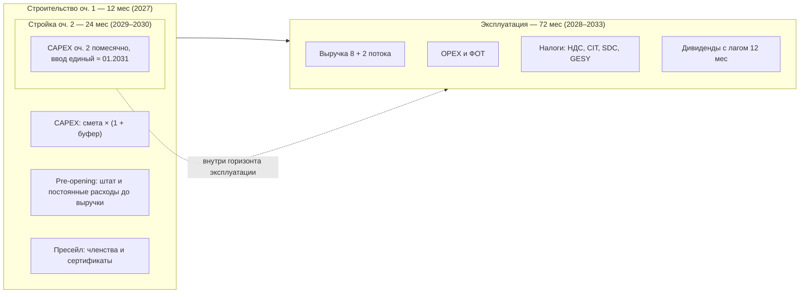
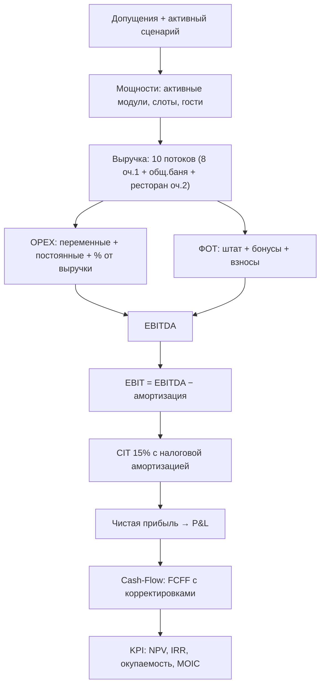
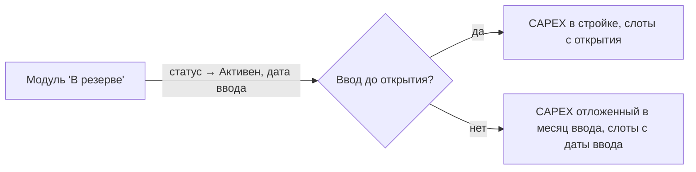
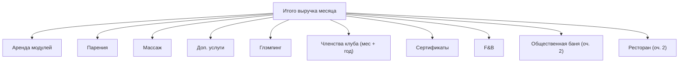
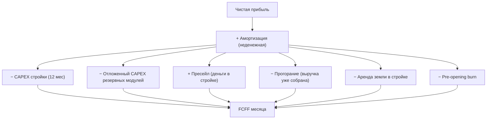

# Руководство по финансовой модели

Подробное описание принципов, допущений и формул финансовой модели
AURA HILLS — банного, SPA и глэмпинг-комплекса на Кипре.

Модель помесячная: каждая метрика посчитана для каждого из 72 месяцев
горизонта и может быть проверена на любом шаге.

## 1. Назначение модели

Модель отвечает на вопросы инвестиционного решения:

- Сколько денег нужно вложить и когда — **пиковая потребность в финансировании**;
- Когда проект вернёт деньги — **окупаемость и дисконтированная окупаемость**;
- Сколько проект заработает — **NPV, IRR, MOIC, cash-on-cash**;
- Насколько устойчив результат к ошибкам в допущениях —
  **анализ чувствительности и точка безубыточности**;
- Что будет, если спрос окажется ниже плана — **сценарии Conservative / Base / Aggressive**.

## 2. Временная структура

Горизонт — операционка **72 месяца** плюс фаза стройки очереди 1:

Все денежные потоки учитываются в том месяце, когда они происходят.
Отложенные события — пресейл, активация резервных модулей, отложенный CAPEX,
стройка и ввод очереди 2 — привязаны к конкретным месяцам, а не размазаны
усреднённо. Вторая очередь строится «на фоне» работающего проекта:
её инвестиционный отток идёт в операционных месяцах 2029–2030,
а выручка начинается с единой даты ввода ≈ январь 2031 (раздел 21).

## 3. Логика расчёта

Расчёт выполняется одним последовательным проходом: результат каждого шага —
вход для следующего. Такой порядок исключает циклические зависимости и делает
каждую цифру воспроизводимой.

## 4. Сценарии

### 4.1 Матрица сценариев

Три встроенных сценария задают траекторию спроса на 5 лет эксплуатации.
Каждый сценарий — это набор годовых векторов:

| Параметр | Conservative | Base | Aggressive |
|---|---|---|---|
| Загрузка бань, год 1 → 5 | 35% → 60% | 50% → 75% | 65% → 90% |
| Загрузка парений, год 1 / 3 | 35% / 65% | 50% / 85% | 65% / 95% |
| Загрузка массажа, год 1 / 3 | 20% / 45% | 30% / 65% | 45% / 80% |
| Загрузка глэмпинга, год 1 / 3 | 20% / 45% | 40% / 65% | 60% / 80% |
| Месячных членов, год 1 / 3 | 20 / 70 | 50 / 120 | 80 / 180 |
| Доля реализации услуг (uptake) | 20% | 30% | 40% |
| Рост цен в год | +3% | +3% | +5% |
| Буфер CAPEX | +20% | +10% | +5% |
| Выход на план (ramp) | 12 мес | 9 мес | 6 мес |
| Задержка стройки | 4 мес | 1 мес | 0 |
| Множитель энергозатрат | ×1.3 | ×1.0 | ×0.9 |

Задержка стройки сдвигает дату открытия и удлиняет период CAPEX-графика:
аренда земли и pre-opening платятся дольше, первая выручка приходит позже.
Множитель энергозатрат масштабирует электроэнергию и отопление.

Загрузка услуг — отдельный вектор-множитель к доле реализации:
услуги живут в депозит-кошельке гостя и масштабируются слотами бань,
но реально берут включённую услугу не все — парения в год 1 берут
50% гостей Base-сценария, а не 100%. Переключатель «Пакетный режим»
задаёт базовую долю реализации (uptake): включён (`meta.mode` = «Да» —
текущая настройка) — услуга входит в слот и uptake = 100%; выключен —
берётся значение из строки «Доля реализации услуг». Итоговая доля
гостей с услугой = `uptake × загрузка услуги`.

### 4.2 Годовые векторы

Все потоки заданы **явно по пяти годам** в матрице сценариев —
интерполяций и унаследованных из Excel коэффициентов нет. Промежуточные
годы (2, 4, 5) редактируются так же, как явные годы 1 и 3, — через
строки «X — Год N» на вкладке «Сценарии».

## 5. Мощности и ограничения

### 5.1 Банные модули и слоты

Каждый банный модуль продаёт время: 4 слота в день — утренний, два дневных,
вечерний. Вместимость слота — гостевых мест модуля. **Цена слота
фиксирована баней и не зависит от времени суток** (решение заказчика);
доли спроса по слотам суток задают лишь разложение по времени, а доли
между банями равные — следуют из одинакового числа слотов в день.

| Модуль | Статус | Ввод | Вместимость слота | Цена слота, € |
|---|---|---|---|---|
| №1 | Активен | 2028-01 | 4 гостя | 250 |
| №2 | Активен | 2028-01 | 8 гостей | 500 |
| №3 | Активен | 2028-01 | 12 гостей | 750 |
| №4–6 | В резерве | 2031-01 | 6 гостей | 500 |

Месячная ёмкость модуля в слотах:

$$S_m = 30 \times \text{слоты/день} \times \text{uptime} \times K_{load}$$

где uptime = 95% — резерв ~1.5 дня в месяц на профилактику и
межсезонное обслуживание; $K_{load}$ — помодульный коэффициент (для
дифференциации «удобных» и «менее удобных» модулей).

### 5.2 Реализованные слоты

$$s_m = S_m \times \min(1,\; L_{baths} \times \text{seas} \times \text{ramp} \times dm)$$

- $L_{baths}$ — загрузка сценария по году;
- $\text{seas}$ — сезонность месяца (ниже);
- $\text{ramp}$ — выход на план: $\min(1, (k+1)/\text{rampMonths})$;
- $dm$ — мультипликатор спроса (стресс-ручка, по умолчанию 1.0).

Загрузка ограничена 100%: при пике сезонности лишний спрос обрезается —
модель не показывает невозможную выручку.

### 5.3 Сезонность

Годовой профиль — 12 коэффициентов, среднее = 1.0.

| Месяц | Бани | Глэмпинг |
|---|---|---|
| Янв / Фев | 1.25 / 1.20 | 0.30 / 0.40 |
| Мар / Апр | 1.10 / 1.05 | 0.70 / 1.10 |
| Май / Июн | 0.90 / 0.70 | 1.20 / 1.10 |
| Июл / Авг | 1.00 / 0.65 | 0.80 / 0.80 |
| Сен / Окт | 0.90 / 1.20 | 1.10 / 1.20 |
| Ноя / Дек | 1.25 / 1.00 | 0.60 / 0.30 |

Профили противофазны: баня — зимний продукт, глэмпинг — летний.
Это сглаживает годовую выручку комплекса.

### 5.4 Резервные модули — опция роста

Резервные модули не создают выручку, не тратят CAPEX и **не несут
помодульный OPEX**, пока их не активировать. До месяца ввода модуль
«не существует»: его слоты не входят в ёмкость, он не размывает лимит
членов и не получает обслуживание.

Активированный модуль с вводом после открытия платит свою долю
помодульного CAPEX в месяц запуска — это real option: расширение
платится из операционного потока, а не из стартовых инвестиций.
Помодульный CAPEX собирается из всех строк спецификации с количеством
`MODULES_COUNT` (по одному на модуль) и `MODULES_COUNT:N` (по N на
каждый модуль — например, «Ванны Афродиты» = `MODULES_COUNT:2`, т.е.
две ванны на модуль). Входной НДС отложенного CAPEX засчитывается
в месяц запуска; бухгалтерская амортизация такого оборудования идёт
от месяца запуска.

**Очередь 2** использует тот же механизм, но объекты другие: четыре
VIP-комплекса (`vip1`–`vip4`) плюс общественная баня (`public`).
Слотовая механика VIP идентична модулям очереди 1, у общественной
бани слотов нет — это поток посетителей (раздел 21). Резервные
«модули №4–6» были плейсхолдером и заменены реальным составом —
дублирования мощностей нет.

## 6. Выручка — десять потоков

Потоки 1–8 работают с открытия очереди 1; потоки 9–10 — с единого
ввода очереди 2 и при выключенных объектах равны нулю.

Общий множитель цен каждого потока — годовая индексация:

$$g_k = (1 + p_{growth})^{\lfloor k/12 \rfloor}$$

### 6.1 Аренда модулей

Слоты продаются по помодульному прайсу, взвешенному долями спроса на
время суток (slotMix): утро 15%, день-1 15%, день-2 30%, вечер 40%.

$$Rev_{rent} = \sum_m s_m \cdot p_m \cdot g_k$$

Цена слота фиксирована баней (250/500/750 €), доли спроса между банями
равные — из одинакового «слотов/день». Временной микс суток (утро /
два дневных / вечер) редактируется в Допущениях и влияет только на
разложение слотов по времени, не на выручку.

### 6.2 Парения

Парения продаются гостям занятых слотов: доля гостей, берущих услугу —
uptake сценария (в пакетном режиме uptake = 100% — услуга включена).

$$
Rev_{steam} = slots \times \bar{C} \times up \times L^{steam}_{y} \times
\left[(1 - w) \cdot d_{steam} \cdot \frac{w_j p_j}{\sum w_j p_j}
+ u \cdot w_j (p_j - d_{steam})\right] \times g_k
$$

- $\bar{C}$ — средняя вместимость слота;
- $up$ — effectiveUptake сценария (100% в пакетном режиме);
- $L^{steam}_{y}$ — загрузка парений сценария по году;
- $w$ = 20% — доля кошелька: часть депозита гостя, уходящая на услуги;
- $d_{steam}$ = €50 — базовая стоимость парения в депозите;
- $u$ — доля апгрейдов сверх депозита (по умолчанию 0 — консервативно);
- меню: Классика €50, Дубль €100, Афродита €150, Боги Олимпа €250 —
  равные доли по 25% (редактируются в Допущениях).

### 6.3 Массаж

Формула идентична парениям — со своей загрузкой $L^{massage}_{y}$,
депозитной базой €60 и меню из 8 позиций (прайс заказчика, равные
доли по 12.5%): классический €60, глубокий €120, SPA-ритуал €150,
премиум/огненный €200, мыльно-веничный €70, пилинг Кесе €50,
экспресс €40, стоун-терапия €100.

### 6.4 Дополнительные услуги

Купели, чаны, ванны — берутся из кошелька депозита:

$$
Rev_{extra} = slots \times \bar{C} \times up \times L^{extra}_{y} \times
w_{wallet} \times d_{base} \times \frac{w_j p_j}{\sum w_j p_j} \times g_k
$$

где $L^{extra}_{y}$ — собственный сценарный вектор загрузки доп. услуг
(ниже парений: допы берёт меньшая доля гостей).

20% депозита €110 распределяется по семи позициям прайса пропорционально
«вес × цена». За пределы кошелька продажи не выходят — консервативно.

### 6.5 Глэмпинг

3 юнита: 2 малых по €165/ночь, 1 большой по €235. Загрузка — отдельный
сценарный вектор с летней сезонностью:

$$Rev_{glamp} = 30 \times \sum_{u} u \cdot L_{glamp} \cdot \text{seas}_{glamp} \cdot \text{ramp} \cdot price \cdot g_k$$

**OTA-канал.** 30% ночей продаётся через Booking/Airbnb с комиссией 17% —
комиссия учитывается в OPEX, а не уменьшает цену:

$$OPEX_{ota} = Rev_{glamp} \times 30\% \times 17\%$$

Установка доли в 0% — явное допущение «только прямые продажи».

### 6.6 Членства клуба

Два продукта: месячное членство €200 и годовое €1500.
Месячные члены — сценарный вектор. Годовые задаются планом активных
членов по годам — 30 / 50 / 80 / 120 / 120; каждый приносит
€1500 / 12 ≈ €125 выручки в месяц.

**Вытеснение слотов.** Члены клуба реально приходят — их визиты занимают
ёмкость до платных продаж:

$$\text{слоты}_{члены} = \frac{(\text{мес} + \text{год}) \times 2\ \text{визита/мес} \times 2\ \text{гостя}}{\bar{C}}$$

В пиковые месяцы членские слоты вытесняют платные — модель честно снижает
выручку аренды. Компенсация: гости-члены добавляются в посетителей F&B.

### 6.7 Сертификаты

Подарочные сертификаты €150, план — 65 шт/мес с рампой и мультипликатором
спроса. Погашение — 85% проданных (по 1 гостю на сертификат): погашённые
занимают ёмкость и несут COGS/F&B, непогашённые 15% — чистая выручка
(breakage).

### 6.8 F&B

Кафе-бар: средний чек €10 на гостя (включая гостей-членов):

$$Rev_{fb} = guests \times €10 \times g_k$$

Себестоимость продуктов 35% выручки F&B — в OPEX; повар — в штате
(условная роль, включается вместе со слоем). Гости общественной бани
сюда не входят — они питаются в ресторане (6.10).

### 6.9 Общественная баня (очередь 2)

Большой банный комплекс на 40 человек, работа 9:00–23:00, **без
слотов** — поток посетителей. Билет €35 включает вход и все зоны
комплекса (прачка не включается):

$$Rev_{pub} = 30 \cdot C_{day} \cdot load \cdot season_k \cdot ramp \cdot p_{ticket} \cdot g_k$$

где `C_day` — пропускная способность в день (40), `load` — сценарная
загрузка в долях пропускной (вектор `publicBathLoad`), `ramp` — своя
рампа очереди 2 (`phase2.rampMonths`). Посетители добавляются к числу
гостей месяца и участвуют в гостевых переменных расходах.

Сервисный спенс гостей общественной бани (трата на услуги из кошелька)
сливается в потоки парений/массажа/доп.услуг — поэтому труд пармастеров
и материалы процедур учитывают и этот спрос.

НДС: поток идёт по стандартной ставке 19%.

### 6.10 Ресторан (очередь 2)

Ресторан на 40 посадок — отдельный F&B-поток (плейсхолдер-модель до
детализации концепции). Работает на внешних гостей и гостей бани:

$$Rev_{rest} = 30 \cdot seats \cdot turns_{day} \cdot load \cdot check \cdot infl$$

где `check` — средний чек (по рынку Кипра, по умолчанию ~€28),
индексируемый **общей инфляцией**, а не ростом цен бань. Загрузка —
сценарный вектор `restLoad`. Ресторан активен только вместе с
общественной баней; его food-cost считается от собственной выручки.

НДС: ставка F&B (9%).

### 6.11 Депозитная политика

Слот продаётся с депозитом €110 на юнит (несгораемый за юнитом). Депозит
определяет базу кошелька для услуг и апгрейдов — это не дополнительная
выручка, а механизм привязки продаж.

## 7. Пресейл и отложенная выручка

За 3 месяца до открытия запускается пресейл: сертификаты, месячные и
годовые членства года 1 по плановым ценам. Продажи дают живые деньги
в стройке, но услуга ещё не оказана — это обязательство.

Режим `presaleMode` задаёт семантику продаж:

| Режим | Смысл |
|---|---|
| **deferred** — «Предоплата (без двойного счёта)» | Пресейл продаёт те же сертификаты и членства, которые уже заложены в операционный план: деньги приходят в стройке, а в P&L продажи идут по обычному графику — предоплата лишь ускоряет поступление кэша. Пул в CF показывает ещё не «прогоревшее» обязательство |
| **incremental** — «Доп. канал сверх плана» | Прежняя Excel-семантика: пресейл — отдельная выручка поверх плана, без погашения обязательства. Завышает проект (NPV выше на ~€50–60k), оставлен только для сравнения с исходной книгой |

Строка «Пул предоплат» в Cash-Flow показывает остаток обязательства
перед гостями на каждый месяц — она круглая: приход в стройке,
прогорание в эксплуатации.

## 8. Земля

Три режима, переключаемые в Допущениях:

| Режим | Эффект |
|---|---|
| **У основателей** *(по умолчанию)* | Земля не покупается и не арендуется: ни CAPEX, ни аренды в OPEX — вклад основателей в проект |
| **Покупка** €80 000 | Входит в CAPEX стройки, не амортизируется, нет аренды в OPEX |
| **Аренда** €800/мес | Платится с 1-го месяца стройки; в эксплуатации — в OPEX с индексацией |

## 9. CAPEX и амортизация

### 9.1 Структура сметы

Смета в евро. Основные блоки:

- **Модули**: банные комплексы (€210k по WBS заказчика, по числу модулей),
  модульные дома глэмпинга, ванны Афродиты, ледяные купели, снежная комната;
- **Инженерия**: электрокоммуникации НЭС/ВЭС, солнечные панели, водоснабжение;
- **Проект (soft costs €150k)**: АР+КР €30k, инженерные проекты MEP €25k,
  разрешения ETEK/EAC €35k, авторский надзор и стройконтроль €60k;
- **Стройка**: СМР €300k (реконструкция здания + фундаменты + террасы),
  организация строительства, непредвиденные (12 мес), транспорт;
- **Благоустройство**: €39k — планировка/дренаж, дорожки, парковка,
  озеленение с капельным поливом, LED-освещение, fire pits;
- **IT-слой**: сеть/WiFi/видеонаблюдение €12k, POS и железо €15k,
  кастомная разработка (букинг+CRM+учёт+сайт) €55k, внедрение €13k;
- **Наполнение**: мебель и оборудование — рассчитывается из справочника
  номенклатуры (позиции `use='CAPEX'`, «Кол-во» = закуп на открытие).
  Мебельная часть переоценена по спецификации прямого
  импорта из Китая (€41 170: FOB-цены + фрахт NC-232 €7k). Печной узел,
  гидротермальная зона, клининг и инженерия — по позициям ТЗ-2;
- **Смета закупа**: стартовые запасы расходников (`initialQty` у
  OPEX/Спецификация-позиций) — отдельной группой «Смета закупа»
  в отчёте CAPEX, правится на одноимённой вкладке в разделе «Параметры».

Печи и купели помодульно не дублируются: они живут в номенклатурном
наполнении (NC-184–190), строки «Печное оборудование»/«Купели» из сметы
сняты во избежание двойного счёта.

Вкладка «CAPEX» в Отчётах — это сметная ведомость: строки сгруппированы
по разделам («Модули и конструкции», «Инженерия и сети», «Проект и
разрешения (soft costs)», «Строительные работы», «Благоустройство»,
«Сопутствующие расходы стройки», «Наполнение (мебель и оборудование)»,
«Прачечная (своя)», «Смета закупа», «IT», «Земля»), у каждого
раздела — подытог.

Сама смета редактируется на вкладке **«Смета стройки»** (Параметры):
цена €, количество, единица, раздел и флаги строки — помодульная
(`MODULES_COUNT`, кол-во считается на каждый активный модуль) и условная
(«Прачечная (своя)» — строки входят в CAPEX только при режиме «Своя»
в Допущениях → Прачечная; при «Аутсорсе» оборудование не покупается,
а стирка идёт в OPEX по тарифу). Группа «Прачечная (своя)» ~€8k
амортизируется в общем графике.

Три позиции разложены по WBS заказчика до строк работ
(ед./кол-во/ставка/сумма + категория затрат) — и **редактируются**
в «Смете стройки»: бейдж `WBS·N` раскрывает секции и позиции,
цена строки выводится из суммы детализации и вручную не правится.
У помодульной строки задаётся **эталонный объём (wbsQty)** —
объём, на который составлена детализация: цена = ΣWBS / wbsQty.

- «Банные модуля (Комплексы)» — разделы 1.1–1.6 (каркас, фасады,
  отделка парных, кабинеты, двери, шеф-монтаж), €70k на модуль;
  эталонная WBS составлена на 3 модуля (€210k, `wbsQty = 3`),
  цена строки = ΣWBS ÷ 3 и масштабируется под фактическое число
  активных модулей;
- «Строительные работы» — разделы 2.1–2.3 (реконструкция здания
  155.33 м², фундаменты, террасы 186.55 м²), €300k;
- «Благоустройство» — разделы 3.1–3.6 (дренаж, дорожки, парковка,
  озеленение, LED, fire pits), €39k.

Строки «Наполнение» и «Закуп: стартовые запасы» разворачиваются
по категориям номенклатуры с подытогами и построчно по SKU
(код, ед., qty, landed-цена).

Итоговый CAPEX = смета × (1 + буфер сценария): в Conservative буфер +20%.

### 9.2 Две амортизации

| Группа | Доля CAPEX | Бухг. срок | Налоговый срок |
|---|---|---|---|
| Модули и конструкции | 40% | 10 лет | 25 лет |
| Оборудование | 45% | 7 лет | 7 лет |
| Прочее | 15% | 5 лет | 5 лет |

- **Бухгалтерская** — в P&L (EBIT = EBITDA − амортизация) и обратно
  прибавляется в FCFF.
- **Налоговая** (capital allowances) — уменьшает базу CIT. Разница создаёт
  реальный налоговый щит: конструкции в налоге списываются медленнее.

Земля в режиме покупки в амортизацию не входит.

## 10. OPEX

$$\text{OPEX} = \text{переменные} + \text{постоянные} + \text{IT} + \text{аренда} + \%\text{-блок}$$

### 10.1 Переменные — по нормам расхода

Каждая позиция справочника «Номенклатура» имеет норму расхода:
на слот, на гостя или на месяц. Стоимость единицы — **landed cost**:

$$landed = price + \max(\text{доставка фикс},\; price \times \%)$$

Примеры драйверов: веники и косметика — на слот; вода/электро переменная
часть — на гостя; химия клининга — на месяц. Индексируются инфляцией.

Полное описание справочника — три режима учёта, все колонки, типовые
настройки и диагностика — в **разделе 11 «Номенклатура»**.

### 10.2 Постоянные

| Статья | €/мес |
|---|---|
| Маркетинг и реклама | max(5 000, 3.5% выручки) |
| Электроэнергия | 3 000 |
| Страхование | 1 000 |
| Водоснабжение | 800 |
| Прочие операционные | 600 |
| Бухгалтерия / юрист | 400 |
| Отопление (газ) | 300 |
| Транспорт | 300 |
| Обслуживание модулей | 100 × активных модулей |

Маркетинг — гибрид: больший из фиксированной базы и доли выручки месяца.
Электроэнергия и отопление дополнительно масштабируются сценарным
множителем энергозатрат.
Все статьи индексируются инфляцией ежегодно:
$\times (1 + i)^{\lfloor k/12 \rfloor}$. Флаг «на модуль» масштабирует
статью на число активных модулей — расширение честно растит затраты.

### 10.3 IT-подписки

Отдельный включаемый слой (~€1 530/мес): хостинг €400, MSP €500,
телефония €150, SaaS €80, SMM-инструменты €100, домены €50,
резерв на комиссии €250. Индексируется инфляцией.

### 10.4 Процентный блок

| Статья | База | Ставка |
|---|---|---|
| Эквайринг | вся выручка | 2% |
| Ремонт и обслуживание | вся выручка | 3% |
| Food-cost | выручка F&B | 35% |
| OTA-комиссия | OTA-ночи глэмпинга | 17% |

## 11. Номенклатура — справочник закупок

«Номенклатура» — единый каталог всего, что комплекс закупает:
от веников и халатов до печей и мебели. Это **справочник**, а не
отчёт: позиции сами по себе не тратят деньги — расход возникает только
из заполненных полей. Одна и та же строка каталога может попадать
в три разных места модели в зависимости от режима учёта.

### 11.1 Три режима учёта

Переключатель **«Учёт»** в последней колонке определяет роль позиции
и переносит её между вкладками интерфейса (OPEX / CAPEX /
Спецификация). Каждая вкладка показывает только рабочие колонки:

| Режим | Что делает позиция | Свои колонки |
|---|---|---|
| **OPEX** | Помесячное списание `норма × база × landed × инфляция` в переменные расходы (отчёт «OPEX», статья из колонки «Статья OPEX») | Статья OPEX, Норма, База |
| **CAPEX** | Разовая закупка `landed × Кол-во` → строка «Наполнение» в инвестициях (отчёт «CAPEX») | Кол-во |
| **Спецификация** | Материал для калькуляции себестоимости услуг во вкладке «Спецификации»: расход задаётся количеством в спеке услуги. Поле «Норма» у таких позиций **не применяется** — иначе получилось бы двойное списание | Статья OPEX |

### 11.2 Общие колонки (видны во всех вкладках)

| Колонка | Смысл | Влияет на деньги? |
|---|---|---|
| Код | Уникальный идентификатор `NC-XXX`. По коду позицию привязывают к спецификациям услуг | Связи, не суммы |
| Наименование | Свободный текст для чтения | Нет |
| Тип | Расходник / Не-расходник (ОС) / прочее — группировка строк | Нет |
| Ед. | шт, кг, л — справочно | Нет |
| Цена € | Закупочная цена поставщика без доставки | Да |
| Дост. €/ед | Фиксированная доставка за единицу | Да |
| Дост. % | Доставка в процентах от цены | Да |
| Landed € | `цена + max(дост. €/ед, цена × дост. %)` — вся себестоимость считается от landed | Да |

> ⚠ Доставка — это **максимум** из двух способов, а не сумма: фикс —
> «минимальный тариф», процент — «доля от цены», берётся более дорогой.
> Для чисто фиксированной доставки ставьте «Дост. %» = 0; для чисто
> процентной — «Дост. €/ед» = 0. Пример: цена €150, доставка €10/ед,
> доставка 10 % → landed = 150 + max(10, 15) = **€165**.

### 11.3 Вкладка OPEX — переменные расходы

| Колонка | Смысл |
|---|---|
| Статья OPEX | Статья переменных расходов, в которую летят списания («Дрова основные», «Химия», …). **Пусто → позиция вообще не списывается** |
| Норма | Единиц расхода на единицу базы: 0.25 веника на слот, 0.1 л масла на гостя, 2 баллона в месяц |
| База | `слот` — оплаченные слоты месяца; `гость` — все посетители включая членов; `мес` — ровно 1 |

Стартовый запас (`initialQty`) у позиций OPEX/Спецификация правится на
вкладке **«Смета закупа»**: `landed × кол-во` → строка «Закуп: стартовые
запасы» в CAPEX разово в стройке.

Месячное списание: `норма × база месяца × landed × инфляция^год`.
Пример: веник landed €5.85, норма 0.25/слот, месяц с 400 слотами →
0.25 × 400 × 5.85 = **€585**.

**Стартовый комплект + пополнение.** Закуп на открытие (вкладка «Смета
закупа») решает паттерн халатов и полотенец: 300 штук покупаются к открытию
разово (CAPEX), а норма (≈ запас ÷ срок жизни) моделирует регулярную
замену по износу.
Задавайте норму как темп *замены*, а не полный запас — иначе первые
месяцы получат двойной расход.

### 11.4 Вкладка CAPEX — разовая закупка

| Колонка | Смысл |
|---|---|
| Кол-во | Единиц, закупаемых в стройке: `landed × кол-во` → «Наполнение» |

Чистая разовая закупка (мебель, печи, оборудование): помесячно ничего
не списывается, колонки нормы у режима нет — «Кол-во» само является
закупкой на открытие. Нужно «оборудование + расходка к нему» —
заведите расходку отдельной OPEX-позицией.

### 11.5 Вкладка Спецификация — библиотека материалов

Позиция — ингредиент для калькуляции услуг: во вкладке «Спецификации»
к процедуре привязывают её код с количеством на процедуру (напр.,
1 веник премиум + 30 мин пармастера) — отсюда себестоимость и маржа
каждой услуги (см. раздел 12).

**Норма расхода у позиции «Спецификация» не используется.** Расход
материала определён один раз — в спецификации услуги (`кол-во на
процедуру`). Это осознанный антидубль: если бы материал списывался и
через спеку, и через общую норму, каждая продажа списывала бы его
дважды. Поэтому любой код, вошедший хотя бы в одну спецификацию,
полностью исключается из нормативного OPEX — даже в месяцы без продаж.

Стартовый закуп `landed × кол-во` задаётся на вкладке «Смета закупа»
и уходит разово в стройку (строка «Закуп: стартовые запасы» в CAPEX),
а дальнейшее пополнение идёт через продажи услуг по спекам.

Колонка «Статья OPEX» при этом остаётся рабочей: она определяет, в какую
строку отчёта OPEX группируется спековый расход материала (по умолчанию —
по категории позиции). Так дрова NC-087, списываемые через спеку аренды,
попадают в статью «Топливо и розжиг», а не в безликое «Материалы услуг».

> ⚠ Гибрид «и в спеке, и сам по себе» сейчас не поддержан: позиция
> может расходоваться либо через услуги, либо через общую норму.
> Если появится материал с двойным режимом (например, дрова для чана
> вне арендных слотов) — заводите отдельную OPEX-позицию.

### 11.6 Что проверить, если «не считается»

- **OPEX по позиции = 0** → не заполнена статья OPEX, норма = 0,
  или база «слот», а в месяце нет оплаченных слотов;
- **«Наполнение» в CAPEX = 0** → у CAPEX-позиций «Кол-во» = 0;
- **«Закуп: стартовые запасы» в CAPEX = 0 / строки нет** → ни у одной
  OPEX/Спецификация-позиции нет закупа на открытие (см. «Смета закупа»);
- **Цену поменяли — суммы нет** → расчёт идёт от landed, проверьте
  доставку;
- **Позиция пропала из таблицы** → она в другой вкладке: переключите
  сегмент OPEX / CAPEX / Спецификация;
- **Списание меньше ожидаемого у позиции «Спецификация»** → её норма
  намеренно игнорируется (антидубль, §11.5): расход живёт только
  в спецификациях услуг. Общий помесячный расход такой позиции не
  считается — при надобности заведите отдельную OPEX-позицию.

## 12. Спецификации услуг — калькулятор себестоимости

Вкладка «Спецификации» отвечает на вопрос «сколько на самом деле стоит
провести одну услугу» — парение, массаж, аренду бани — и **задаёт KPI
исполнителей**: какой процент от прайса услуги получает каждая роль её
состава. Материалы состава списываются в переменные расходы по числу
проведённых услуг (COGS услуг в OPEX, раздел 10), а труд уходит в ФОТ
как KPI-бонус (раздел 13.2). Позиция, вошедшая в спецификацию,
из нормативных OPEX-норм исключается — двойного списания нет.

### 12.1 Формула себестоимости

$$\text{себес} = \underbrace{\sum\; \text{норма} \times \text{landed материала}}_{\text{Материалы €}} + \underbrace{\text{цена} \times \sum\; \% \text{ролей}}_{\text{Труд € (KPI)}}$$

$$\text{маржа} = \text{цена} - \text{себес}, \qquad \text{марж}\% = \text{маржа}/\text{цена}$$

### 12.2 Колонки таблицы

| Колонка | Смысл |
|---|---|
| Услуга | Название процедуры (редактируется). Каретка ▸ раскрывает состав |
| Цена € | Прайсовая цена услуги — база маржи **и база KPI** |
| Материалы € | Σ по строкам состава: `норма × landed материала` |
| Труд € | `цена × Σ % ролей` — столько уходит исполнителям за одну услугу |
| Себес € | Материалы + Труд |
| Маржа € | Цена − Себес |
| Марж. % | Бейдж: зелёный ≥ 60 %, жёлтый ≥ 30 %, красный ниже |

### 12.3 Состав услуги

Раскройте услугу кареткой — внутри строки двух видов:

- **Материал** — ссылка на позицию «Номенклатуры» по коду
  (доступны позиции с учётом OPEX или Спецификация) + количество на
  процедуру. Цена берётся как landed — с доставкой;
- **Труд (KPI)** — роль из штатного расписания + **процент от прайса**.
  Процент — это доля цены услуги, которую роль зарабатывает за каждую
  проведённую процедуру; он же начисляется бонусом в ФОТ. Несколько
  ролей в составе получают каждая свой процент **от полной цены**
  (пармастер 25 % + помощник 5 % = 30 % цены уходит в KPI).

Строка добавляется кнопкой «+ Добавить» внизу состава: выберите вид
(Материал/Труд), позицию или роль и значение (единиц / % от прайса).

### 12.4 Важные нюансы

- **Цена здесь не управляет выручкой.** Прайс в «Спецификациях»
  используется для маржи и как база KPI, но потоки выручки берут цены
  из параметров «Допущений» (векторы цен парений/массажа/аренды).
  Поменяли прайс — обновите в обоих местах;
- **Аренда бани несёт гарантированные 3% пармастеру** — в цену слота
  встроено его ведение/запаривание, поэтому он получает 3% с каждого
  проданного слота всегда, сверх оклада. Это осознанно отличается от
  30% за процедуры;
- **Несервисные роли в спеки не входят.** Клинеры, охрана, администраторы
  и прочие получают только месячный оклад — трудовых строк для них
  нет, и добавлять их туда не нужно;
- **Удаление услуги** стирает и её состав (вместе с KPI-правилами).
  Удаление позиции номенклатуры оставляет «битую» ссылку в составе —
  себестоимость будет занижена, проверьте спецификации после чистки
  каталога;
- **KPI считается по количеству услуг, а не по выручке потока.** Бонус =
  проданных процедур × прайс спеки × % роли — депозитная схема и
  апгрейды на него не влияют.

## 13. Штат и фонд оплаты труда

### 13.1 Штатное расписание

Штат вводится фазами: на старте минимальный контур, роли расширения
подключаются по календарным датам `from` (таблица «Штат»).

| Роль | Оклад gross, € | Ставок старт | 2029-01 | 2031-01 | 2032-01 |
|---|---|---|---|---|---|
| Пармастер | 1 800 | 4 | 6 | 10 | 12 |
| Массажист | 1 500 | 2 | 3 | 4 | 5 |
| Администратор | 1 200 | 2 | 2 | 4 | 4 |
| Хаусмен | 1 200 | 1 | 1 | 2 | 2 |
| Управляющий | 2 500 | 1 | 1 | 1 | 1 |
| Бронист | 1 320 | 0 | 0 | 1 | 1 |
| Клинер (горничная) | 1 050 | 2 | 2 | 4 | 4 |
| Инженер | 2 200 | 0 | 0 | 1 | 1 |
| Помощник пармастера | 1 350 | 0 | 2 | 2 | 2 |

Старт — 12 ставок (€18 400 окладов в месяц); к 2032 — 32 ставки.
Плюс условные роли: повар €1 500 (включается с F&B) и IT-куратор
€2 500 (включается с IT-слоем).

### 13.2 Полная нагрузка на ФОТ

$$\text{ФОТ} = (\text{оклады} \times i_k + \text{бонусы}) \times (1 + 15.4\%)$$

- оклады индексируются инфляцией ежегодно;
- взносы работодателя — 15.4% (SI 8.8% + GESY 2.9% + Social Cohesion 2%
  + Redundancy 1.2% + HRDA 0.5%) — берутся с окладов **и** KPI;
- бонусы — это **KPI по спецификациям**: у каждой услуги в её составе
  прописан процент от прайса для роли-исполнителя (раздел 12.3):

$$\text{Бонусы}_m = \sum_{\text{услуги}}\; \underbrace{\text{продано услуг за } m}_{\text{по ценовым ступеням}} \times\; \text{прайс спеки} \times \sum_{\text{роли}}\; \%\text{ роли}$$

Экономика: **оклад платится всегда**, KPI — только за реально проведённые
услуги. Пармастер не провёл ни одного парения за месяц → получит голый
оклад. Роль, которой нет в составе услуги (клинер, охрана,
администратор), KPI не получает вовсе. Количество проданных услуг:
для парений/массажа/допуслуг — выручка ценовой ступени ÷ её прайс
(спеки маппятся на ступени по направлению и порядку: SVC-P1 → первый
прайс парений и т.д.); для аренды — реальные проданные слоты каждой
бани, сложенные по тарифу вместимости (баня до 4 гостей → спека
«до 4» и т.п.).

## 14. Налоги Кипра

### 14.1 НДС

Два режима — «Гросс» (НДС внутри цены) и «С возмещением». Ставки:
19% общий (включая общественную баню оч. 2), 9% глэмпинг и F&B
(включая ресторан оч. 2), входной 19%. Входной НДС на закупки
зачитывается; кредит переносится на следующие месяцы. Уплата
поквартальная (по умолчанию): нетто-НДС за квартал платится до 10-го
числа второго месяца после квартала — в Допущениях можно переключить
на помесячную схему.

Модель разделяет два понятия:

- **Начисленный НДС** (output VAT) — изымается из выручки в P&L всегда:
  `revenueNet = gross − vatOut`. EBITDA и EBIT одинаковы в обоих режимах —
  налоговая оптимизация не может украшать операционную прибыль;
- **НДС к уплате** — `max(0, выходной − входной − перенос)` — живёт
  только в Cash-Flow. В режиме «С возмещением» строка «ΔНДС (начисл.−упл.)»
  возвращает в кэш разницу между начисленным и фактически уплаченным НДС.

Входной НДС по CAPEX засчитывается в месяце, когда платятся деньги:
основной CAPEX — в месяцах стройки, отложенные модули — в их месяцы
запуска, очередь 2 — помесячно по окну стройки 2029–2030 (это уже
операционные месяцы, кредит сразу работает против выходного НДС).
Покупка земли входной НДС не создаёт — земля облагается иначе
(упрощение модели).

### 14.2 Налог на прибыль (CIT)

$$CIT = 15\% \times \max(0,\; Rev - OPEX - \text{ФОТ} - \text{налоговая аморт.})$$

Ставка 15% — налоговая реформа Кипра, в силе с 01.01.2026.

Убытки переносятся вперёд. Налоговая амортизация (capital allowances)
медленнее бухгалтерской по конструкциям — ранние годы платят CIT раньше,
чем «подсказывает» P&L.

Платежи идут по календарному году: провизиональный налог на Кипре
платится **31 июля и 31 декабря** (равными долями) — поэтому в таблице
CIT виден в месяцах июля и декабря, а не в июне, как в исходной книге.

### 14.3 Дивиденды, SDC и GESY

Дивиденды начисляются на чистую прибыль с **лагом 12 месяцев** —
распределяется прибыль прошлого года:

$$Div_m = ЧП_{m-12} \times (\Sigma \text{долей партнёров} + 10\%\ \text{УК})$$

Из дивидендов резидентов-домицилов **удерживаются** (не дополнительный
отток компании, а вычет из выплаты партнёру):

- **SDC 5%** — Special Defence Contribution по реформе с 01.01.2026
  (ставка 17% применима к прибыли, заработанной до 2025);
- **GESY 2.65%** — взнос в систему здравоохранения, с годовым потолком
  базы €180 000 на лицо.

Оба взвешиваются по долям резидентов: перевод партнёра в статус
«Нерезидент / Non-Dom» обнуляет оба налога по его доле. УК получает долю
без SDC/GESY; резервный фонд 10% остаётся в компании — не распределяется.

## 15. До открытия: скрытые затраты стройки

Модель честно учитывает период, когда деньги уходят, а выручки ещё нет:

- **Pre-opening** — за 2 месяца до открытия штат нанят и обучается,
  коммуналка и подписки уже платятся: оклады + взносы + постоянные +
  IT OPEX вхолостую;
- **Аренда земли** в режиме lease платится с первого месяца стройки;
- **Пресейл** частично компенсирует этот burn — деньги приходят,
  но обязательство остаётся в пуле предоплат.

Все три потока — отдельные строки Cash-Flow.

## 16. Cash-Flow и FCFF

$$\mathrm{FCFF} = \mathrm{ЧП} + \mathrm{аморт.} + \mathrm{CAPEX} + \mathrm{CAPEX}_{отл.} + \mathrm{пресейл} + \mathrm{прогорание} + \mathrm{земля} + \mathrm{preopen}$$

**Пиковая потребность** — минимум накопленного FCFF: сколько денег проект
съедает в худшей точке. Это честный ответ на вопрос «сколько нужно
инвестору».

## 17. KPI — инвестиционные метрики

| Метрика | Формула | Смысл |
|---|---|---|
| NPV | $\sum_m FCFF_m \cdot (1 + WACC/12)^{-m}$ | Стоимость проекта сверх ставки WACC |
| IRR | $(1+r_m)^{12}-1$ | Эффективная годовая доходность — единственный публикуемый IRR |
| Окупаемость | первый мес с накопл. FCFF > 0 | Без дисконтирования |
| Диск. окупаемость | то же по накопл. DCF | С учётом стоимости денег |
| MOIC | $\Sigma FCFF^{+} / |\Sigma FCFF^{-}|$ | Сколько евро возвращено на вложенный |
| Cash-on-cash | FCFF 3-го года / вложено | Годовая денежная отдача устаканенного года |
| Пиковая потребность | $\min$ накопл. FCFF | Размер инвестиций с запасом |
| Break-even | множитель спроса → EBITDA г.3 = 0 | Доля плана, на которой проект «в ноль» |
| NPV с TV | NPV + $\frac{FCFF_5(1+g)}{WACC-g} \cdot DF_{72}$ | Опция: терминальная стоимость по Гордону |

**Конвенция ставок.** WACC — *эффективная* годовая ставка;
дисконтирование ведётся эквивалентной месячной ставкой
`r_m = (1 + WACC)^(1/12) − 1`. IRR публикуется один — тоже эффективный
годовой: он напрямую сопоставим с WACC.

**Знаменатель MOIC / cash-on-cash** — сумма всех отрицательных месяцев
FCFF («вложено»). Пресейл в стройке уменьшает её, поздние операционные
убытки — увеличивают: это мера «сколько проект максимально просил
денег с учётом того, что вернул до этого». Для запроса «сколько вложить»
смотрите пиковую потребность — минимум накопленного FCFF.

Terminal value по умолчанию выключена — базовые метрики консервативны и
не «дотягиваются» терминалом.

## 18. Анализ чувствительности

Вкладка Sensitivity пересчитывает всю модель в каждой точке — не экстраполяция.

### 18.1 Пять таблиц

| Таблица | Оси | Метрики |
|---|---|---|
| Спрос × WACC | спрос ×0.8–1.2 × WACC −4…+6 п.п. от базы | NPV, диск. окупаемость |
| Рост цен × буфер CAPEX | 0–7% × 0–30% | NPV, IRR |
| Пакет × Загрузка | uptake 30–100% × загрузка ×0.8–1.2 | NPV, IRR |
| Задержка стройки × буфер CAPEX | +0/3/6/9/12 мес × 0–30% | NPV, IRR |
| Уровень цен | ×0.8–1.2 | NPV, IRR |

### 18.2 Tornado — главные драйверы

11 факторов пересчитываются по одному и сортируются по |ΔNPV|:
спрос ±15%, уровень цен ±10%, загрузка ±15%, CAPEX +15%/без буфера,
WACC ±3 п.п., uptime −5/+3 п.п., постоянные OPEX ±15%, оклады ±15%,
food-cost ±5 п.п., доля OTA +15 п.п./0%, инфляция ±1 п.п.

Топ-драйвер в Base — уровень цен: ±10% цены двигает NPV на ~±€0.85M.

### 18.3 Break-even

Бинарный поиск общего множителя спроса, при котором EBITDA 3-го
(устаканенного) года равна нулю. В Base — около 14% планового спроса:
сервисная маржа высокая, покрытие постоянных затрат достигается рано.

## 19. Распределение прибыли

Прибыль распределяется между тремя партнёрами, управляющей компанией и
резервным фондом:

| Участник | Доля | Примечание |
|---|---|---|
| Партнёр 1 | 26.7% | статус: резидент / non-dom — влияет на SDC+GESY |
| Партнёр 2 | 26.7% | — |
| Партнёр 3 | 26.6% | — |
| УК | 10% | дивиденды без SDC/GESY |
| Резервный фонд | 10% | остаётся в компании |

Контрольный индикатор в Допущениях следит, чтобы сумма долей + УК +
резерв всегда равнялась 100%.

## 20. Работа с приложением

- **Допущения** — все базовые входы модели (экономика, налоги, модули,
  сезонность, земля, прачечная, maintenance CAPEX). Правки сохраняются
  в браузере автоматически и переживают перезагрузку. Кнопка «Сбросить»
  возвращает базовые значения.
- **Штат** — штатное расписание по фазам расширения; условные роли
  (повар, IT-куратор) живут на своих вкладках.
- **Номенклатура** — справочник закупок и норм расхода: три режима
  учёта, landed cost, цены и доставка (раздел 11).
- **Смета стройки** — редактируемый строительный CAPEX: цены, количества,
  помодульные и условные строки, WBS-детализация (раздел 9).
- **Смета закупа** — стартовые запасы расходников на открытие;
  идёт в CAPEX отдельной группой «Смета закупа».
- **Спецификации** — калькулятор себестоимости и маржи каждой услуги
  (раздел 12).
- **IT** — цифровой слой: внедрение в CAPEX, подписки в OPEX, куратор в ФОТ.
- **Сценарии** — активный сценарий переключает всю модель; матрица
  редактируется, можно сохранять/загружать наборы.
- **Отчёты** — помесячные таблицы с итогами по годам; каждая цифра
  снабжена всплывающей формулой (значок формулы рядом со значением).
- **Sensitivity** — пять таблиц чувствительности и tornado-диаграмма
  (раздел 18) — полный пересчёт модели в каждой точке.
- **Документы** — этот раздел: руководства и материалы проекта.

## 21. Вторая очередь строительства

Очередь 2 — расширение комплекса на фоне работающего проекта:
общественный банный комплекс на 40 человек и четыре VIP-комплекса.

**Состав объектов:**

| Объект | Тип | Мощность | Экономика |
|---|---|---|---|
| Общественная баня (`public`) | поток посетителей, без слотов | 40 чел/день, 9:00–23:00 | билет €35, вход + все зоны |
| VIP-1, VIP-2 | слотовые комплексы 200 м² | 4–6 чел, 4 слота/день | €500/слот, как модули оч. 1 |
| VIP-3 | слотовый комплекс 184 м² | 2–4 чел | по аналогии |
| VIP-4 | слотовый комплекс 240 м² | 8–10 чел | по аналогии |

Каждый объект включается отдельным тоглом (частичная реализация);
состав объектов — единое допущение для всех сценариев, сценарии задают
только загрузку (`vipLoad`, `publicBathLoad`, `restLoad`).

**Хронология:**

- стройка 2029–2030 (24 мес, `phase2.constructionMonths`), CAPEX
  распределён помесячно по S-кривой — это отток уже внутри
  эксплуатации очереди 1;
- ввод всех объектов единый, ≈ январь 2031;
- свои параметры у очереди: `phase2.rampMonths` (выход на загрузку),
  `phase2.capexAdj` (буфер стройки отдельно от буфера сценария);
- амортизация объектов стартует с месяца ввода, а не с открытия оч. 1.

**CAPEX и привязка к объектам.** Строки сметы очереди 2 несут поле
`object` (`vip1`–`vip4`, `public`): объектные строки платятся только
при включённом объекте; общие строки (инженерия, проект, надзор) —
если включён хотя бы один объект очереди 2. Базовая смета — около
€1.5M в lean-варианте (модульная технология), WBS-детализация хранится
в самих строках сметы.

**Финансирование** (`phase2.funding`, в Допущениях):

| Режим | Смысл |
|---|---|
| `Из операционного CF` | стройка платится из потока оч. 1; разрывы закрывает обычный equity-транш |
| `Отдельный транш` | акционеры вносят ровно отток месяца стройки — строка «в т.ч. транш оч. 2» в CF |

**Штат** — покрыт фазами `fot.phases`: фаза 2031-01 (год 1 оч. 2) и
2032-01 (год 2) расширяют расписание автоматически по дате вступления.

**Закуп стартовых запасов оч. 2** — отдельная колонка `initialQtyP2`
в Смете закупа: расходится со вводом очереди 2, суммарно с закупом
оч. 1 не смешивается.

## 22. Что модель сознательно не учитывает

Для честности картины перечислены упрощения:

- Нет кредитного финансирования — весь CAPEX считается собственным
  капиталом (FCFF-подход);
- Оборотный капитал — только через пул предоплат; дебиторка/кредиторка
  не моделируются;
- Сезонные распродажи и динамическое ценообразование не учитываются;
- НДС и CIT — по действующим ставкам без учёта льгот и налоговых каникул;
- Резервные модули и объекты очереди 2 при активации дают ту же экономику,
  что базовые — возможный эффект масштаба не учитывается;
- ресторан оч. 2 — плейсхолдер-модель (чек × обороты × загрузка), без
  детальной концепции кухни;
- Terminal value — опциональна и выключена по умолчанию.

## 23. Вкладка «Допущения» — карта всех блоков и полей

Полное описание каждого поля вкладки: что это, куда уходит в модель
и какой диапазон разумен. Формат значений по умолчанию указан в скобках.

### 23.1 Общие

| Поле | Что это | Как влияет |
|---|---|---|
| Инфляция (2.5%) | Годовая индексация цен затрат | Оклады, постоянные OPEX, переменные нормы, IT-подписки и аренда земли умножаются на $(1+i)^{\lfloor k/12 \rfloor}$ — с шагом раз в год, а не помесячно |
| Ставка дисконтирования | `CAPM` — ставка собирается из составляющих ниже; `Ручная` — фиксированный WACC | Определяет дисконтирование FCFF → NPV, дисконтная окупаемость, TV. Эффективная годовая ставка; помесячный эквивалент $(1+WACC)^{1/12}-1$ |
| Безрисковая rf (3.2%) | Доходность 10-летних гособлигаций в EUR | Слагаемое CAPM: $k_e = r_f + \beta \cdot ERP + c_{премия} + s_{премия}$ |
| Бета (1.4) | Unlevered-бета отрасли leisure/hospitality | Масштабирует рыночную премию; >1 — проект волатильнее рынка |
| Премия за риск ERP (5.5%) | Equity risk premium зрелого рынка | Мультиплицируется бетой в CAPM |
| Страновая премия (1.5%) | Спред риска Кипра над развитым рынком | Добавляется к стоимости капитала |
| Size / startup премия (5%) | Премия за малую капитализацию и стадию запуска | Крупнейший «мягкий» компонент WACC; итог $k_e \approx 17.4\%$, долга нет → WACC = $k_e$ |
| WACC (ручная) | Фиксированная ставка, если режим «Ручная» | Игнорирует CAPM-поля; по умолчанию 14% |
| Terminal value | Вкл/выкл терминальной стоимости | Вкл: к NPV добавляется $\frac{FCFF_5(1+g)}{WACC-g}$, дисконтированная на 72-й месяц. Выкл (дефолт) — консервативно, только горизонт 5 лет |
| Рост после горизонта g (2.5%) | Вечный темп роста FCFF в модели Гордона | Должен быть заметно ниже WACC — иначе TV «взрывается». Обычно ≈ инфляция |
| Exit-мультипликатор EV/EBITDA (6×) | Отраслевой мультипликатор продажи бизнеса | Cross-check Гордона: показывает подразумеваемый EV/EBITDA терминальной TV; leisure-норма 5–7× |

### 23.2 Режимы

| Поле | Что это | Как влияет |
|---|---|---|
| Пакетный режим (депозит) | `Да` — депозит обязателен: пакет услуг включён в слот; `Нет` — услуги продаются отдельно | При «Да» uptake = 100% и строка «Доля реализации услуг» в сценариях блокируется. При «Нет» услуги продаются по доле uptake сценария |
| Режим НДС | `Гросс` / `С возмещением` | Гросс: входной НДС не возмещается и оседает в расходах. С возмещением: входной зачитывается, в CF платится только нетто-НДС — смещает кэш, но не P&L |
| Мультипликатор спроса (1.0) | Глобальная ручка спроса поверх всех загрузок | Умножает загрузку всех потоков разом — сценарный стресс или апсайд всей модели. 1.0 = нейтрально |
| Загрузка услуг по сценариям | `Да` — у парений, массажа, допов и глэмпинга свои векторы загрузки; `Нет` — все следуют загрузке бань | Разделение траекторий: баня загружена, а массаж может отставать. Выкл — упрощённая модель «всё как бани» |

### 23.3 Налоги и взносы

| Поле | Что это | Как влияет |
|---|---|---|
| CIT (15%) | Налог на прибыль Кипра (реформа с 01.01.2026) | `15% × max(0, прибыль до налога)` с учётом налоговой амортизации; убытки переносятся вперёд. Платится траншами 31.07 и 31.12 |
| НДС стандартный (19%) | Ставка для бань, услуг, членств | Изымается из выручки в P&L (`revenueNet = gross − vatOut`) |
| НДС глэмпинг (9%) | Пониженная ставка размещения | Тот же механизм для потока глэмпинга |
| НДС F&B (9%) | Пониженная ставка общепита | Тот же механизм для F&B |
| НДС входной (19%) | Ставка входного НДС на закупки и CAPEX | В режиме «С возмещением» зачитывается против выходного; кредит переносится |
| Взносы работодателя (15.4%) | SI 8.8% + GESY 2.9% + Social Cohesion 2% + Redundancy 1.2% + HRDA 0.5% | Начисляются на оклады и KPI-бонусы — полная нагрузка на ФОТ |
| SDC на дивиденды (5%) | Special Defence Contribution резидентам-домицилам | Удерживается ИЗ дивидендов партнёра — не отток компании; Non-Dom освобождён. 17% действует лишь на прибыль до 2025 |
| GESY на дивиденды (2.65%) | Взнос в госсистему здравоохранения | Удерживается из дивидендов резидентов вместе с SDC |
| Потолок базы GESY (€180 000/год) | Максимальная годовая база взноса на человека | Свыше потолка GESY не берётся — важно при крупных дивидендах |
| Уплата НДС | Квартально / Помесячно | По закону — поквартально (до 10-го числа 2-го месяца после квартала): нетто-НДС квартала уходит одним платежом. Помесячно — упрощённое списание сразу |

### 23.4 Распределение прибыли

| Поле | Что это | Как влияет |
|---|---|---|
| Партнёр — имя | Справочное название участника | Только подпись в отчётах |
| Доля (26.7/26.7/26.6%) | Доля распределяемой прибыли партнёра | Дивиденды = ЧП прошлого года (лаг 12 мес) × доля; контроль Σ = 100% |
| Налоговый статус | Резидент-домицил / Нерезидент-Non-Dom | У резидента из дивидендов удерживаются SDC и GESY; у Non-Dom — нет |
| Управляющая компания (10%) | Доля УК в распределении | Получает дивиденды без SDC/GESY (юрлицо) |
| Резервный фонд (10%) | Доля прибыли, остающаяся в компании | Не распределяется — снижает дивидендную базу, остаётся на балансе |

### 23.5 Амортизация

Три группы CAPEX, у каждой три числа: **доля** стоимости, **бухгалтерский**
срок (лет, идёт в P&L) и **налоговый** срок (capital allowances для CIT):

| Группа | Доля | Бухг. срок | Налоговый срок |
|---|---|---|---|
| Модули/конструкции | 40% | 10 лет | 25 лет (~4%/год) |
| Оборудование | 45% | 7 лет | 7 лет (~14%/год) |
| Прочее | 15% | 5 лет | 5 лет (20%/год) |

Налоговая амортизация конструкций медленнее бухгалтерской → ранние годы
платят CIT раньше, чем показывает P&L (налоговый щит отложен).
Земля в режиме покупки не амортизируется. Проверка: Σ долей = 100%.

### 23.6 Прочие OPEX

| Поле | Что это | Как влияет |
|---|---|---|
| Эквайринг (2%) | Комиссия платёжного шлюза | % от всей выручки месяца |
| Ремонт/обслуживание (3%) | FF&E-норма на текущий ремонт | % от выручки; отрасль premium leisure 3–4% |
| Маркетинг, min €/мес (5 000) | Фиксированная база маркетинга | Маркетинг = max(база × инфляция, % выручки) |
| Маркетинг, % выручки (3.5%) | Переменная часть маркетинга | Отрасль 3–6%; растит статью вместе с продажами |
| Страхование (€1 000/мес) | Полисы комплекса | Фикс-статья OPEX; рынок €800–2 000/мес |
| Доля глэмпинга через OTA (30%) | Ночи, продаваемые через Booking/Airbnb | Эти ночи облагаются комиссией OTA |
| Комиссия OTA (17%) | Тариф агрегатора | `Rev_glamp × доля OTA × комиссия` → OPEX; 0% доли = «только прямые продажи» |

### 23.7 Членства, сертификаты и ёмкость

| Поле | Что это | Как влияет |
|---|---|---|
| Визитов члена/мес (2) | Сколько раз в месяц приходит член клуба | Формирует членские визиты → ёмкость и сервисный чек |
| Гостей в визите (2) | Сколько гостей приводит член за визит | Визиты × гостей = гостей-членов в месяц |
| Члены занимают слоты | `Да` — членские визиты расходуют слоты ёмкости | Честно вытесняет платные слоты в пик; «Нет» — члены сверх ёмкости (агрессивно) |
| Доля визитов в пиковые слоты (30%) | Часть членских визитов, падающих в пик | Пиковые визиты вытесняют платных гостей; остальные заполняют свободную ёмкость |
| Сервисный чек члена (€40/визит) | Средний чек услуг гостя-члена | Распределяется по потокам пропорционально пакету → COGS спек и KPI |
| Сертификаты: доля погашения (85%) | Доля проданных сертификатов, которую реально гасят | Погашённые — гости с ёмкостью и COGS/F&B; непогашённые 15% — чистая выручка (breakage) |
| Гостей на сертификат (1) | Сколько гостей приходит по одному сертификату | Масштабирует ёмкостную и F&B-нагрузку погашений |

### 23.8 Цены

| Поле | Что это | Как влияет |
|---|---|---|
| Месячное членство (€200) | Абонемент клуба на месяц | Выручка членств: число членов из сценария × цена |
| Годовое членство (€1 500) | Годовой абонемент | План активных членов по годам (30/50/80/120/120) × цена / 12 в месяц |
| Сертификат (€150) | Подарочный сертификат | Выручка потока сертификатов; погашение — по доле выше |
| F&B на гостя (€10) | Средний чек кафе-бара | `гости × чек` — включая гостей-членов и сертификатов |
| Глэмпинг малый (€165/ночь) | Тариф малого юнита | `30 ночей × юниты × загрузка × сезонность × цена` |
| Глэмпинг большой (€235/ночь) | Тариф большого юнита | То же, второй юнит |

Все цены дополнительно индексируются сценарным ростом цен
$(1+p_{growth})^{\lfloor k/12 \rfloor}$.

### 23.9 F&B

| Поле | Что это | Как влияет |
|---|---|---|
| Себестоимость F&B (35%) | Food-cost — доля выручки F&B на продукты | `Rev_fb × 35%` → переменный OPEX; рынок 30–35% |
| Оклад повара (€1 500) | Gross-оклад повара | Условная роль в ФОТ — действует при включённом F&B |
| Поваров (1) | Ставок повара | Множитель оклада; видно во вкладке «Штат» |

### 23.10 Прачечная

Переключатель **Режим стирки** выбирает экономику стирки комплектов:

| Режим | Механика |
|---|---|
| **Аутсорс** (дефолт) | Стирка списывается в OPEX спеками услуг по тарифу прачечной (NC-159 €4.99/гостевой набор, NC-210 €1.5/процедурный). CAPEX чистый |
| **Своя** | Оборудование (~€8k: стиралка, сушка, гладильный стол, инвентарь, вытяжка, подводы) входит в смету стройки группой «Прачечная (своя)» и амортизируется; в OPEX остаются только расходники цикла (ownPrice €0.9/€0.45 — порошок/гель). Коммуналка не считается |

### 23.11 Земля

| Поле | Что это | Как влияет |
|---|---|---|
| Режим владения | Своя / Аренда / Покупка | Своя — €0 и без потоков (вклад основателей). Аренда — платится с 1-го мес стройки в CF и в OPEX операционки. Покупка — стоимость в CAPEX без амортизации |
| Стоимость участка (€80 000) | Цена покупки при режиме «Покупка» | Одноразовый CAPEX; рынок €40–200k |
| Аренда земли (€800/мес) | Арендная ставка при режиме «Аренда» | Рынок: сельхоз €330–650/мес, «под глэмпинг» до €2 000/мес |

### 23.12 Депозит и кошелёк услуг

| Поле | Что это | Как влияет |
|---|---|---|
| Депозит на гостя (€110) | Несгораемый пакетный депозит за юнит | База кошелька услуг — механизм привязки продаж, не дополнительная выручка |
| База парения (€50) | Стоимость парения внутри депозита | Часть кошелька на парения; сверх неё — апгрейды по прайсу |
| База массажа (€60) | Стоимость массажа внутри депозита | Аналогично парениям |
| Доля кошелька на доп.услуги (20%) | Часть депозита на купели/чаны/ванны | `w × депозит` распределяется по прайсу допов пропорционально «вес × цена» |
| Доля апгрейдов сверх депозита (0%) | Продажи сверх кошелька | 0 = консервативно: выручка услуг не выходит за рамки депозита |

### 23.13 Мощности и объёмы

| Поле | Что это | Как влияет |
|---|---|---|
| Глэмпинг малых (2) / больших (1) | Число юнитов размещения | Ёмкость ночей глэмпинга |
| Сертификатов/мес (65) | План продаж сертификатов | База потока сертификатов (с рампой и мультом спроса) |
| Пре-сейл, мес до открытия (3) | Длина окна предпродаж | Кэш членств/сертификатов приходит в стройке |
| Режим пре-сейла | Предоплата / Доп. канал | «Предоплата» — те же членства: кэш в стройке, прогорание в операционке без двойного счёта (рекомендуется). «Доп. канал» — Excel-семантика: пресейл сверх плана, без учёта ёмкости — агрессивно |
| Признание пре-сейла, мес (12) | За сколько месяцев прогорает пул предоплат | Равномерное признание обязательства в P&L операционки |
| Pre-opening, мес (2) | Штат и фикс-расходы до открытия | «Мёртвый» отток в CF конца стройки: оклады+взносы+постоянные+IT, без переменных |

### 23.14 Maintenance CAPEX и стройка

| Поле | Что это | Как влияет |
|---|---|---|
| Maintenance CAPEX | Вкл/выкл резерва на замену | Включает ежегодный отток в операционке |
| % амортизируемого CAPEX в год (1.5%) | Reserve for replacement | Замена печей, купелей, текстиля, IT-железа; отрасль 1.5–4% |
| С операционного года (2) | С какого года эксплуатации начинать отчисления | Год 1 обычно не требует замен — техника новая |
| Капремонт в году (4) / Капремонт, € (60 000) | Разовый капитальный ремонт | Единоразовый CAPEX-отток в заданном году |

Под таблицей показана **S-кривая освоения стройки** — 12 весов
распределения CAPEX-графика по месяцам (4→12→5%, нормируются к 100%;
при смене длительности стройки — равномерно). Задержка стройки и
энергетический стресс задаются в матрице сценариев, а не здесь.

### 23.15 Сезонность

12 месячных множителей для каждого потока (бани, глэмпинг, сертификаты).
Правило: **среднее по году = 1.000** — сценарные загрузки среднегодовые,
поэтому ненормированный профиль искажает загрузку. Индикатор под таблицей
краснеет при отклонении. Профили противофазны: баня — зимний продукт,
глэмпинг — летний, это сглаживает годовую выручку.

### 23.16 Модули бань

| Поле | Что это | Как влияет |
|---|---|---|
| Статус | Активен / В резерве | Резервный модуль вне модели: не продаёт, не потребляет CAPEX и OPEX до активации; помодульные строки сметы ждут ввода |
| Ввод с | Месяц ввода в эксплуатацию (ГГГГ-ММ) | До даты — нет выручки; отложенный CAPEX и амортизация идут с месяца ввода |
| Uptime (95%) | Доля дней в работе | ~1.5 дня/мес на профилактику печей и водоёмов; реалистично 92–97% |
| Слотов/д (4) | Слотов в день: утро, два дневных, вечер | Ёмкость: `30 × слоты × uptime` слотов/мес |
| Мест (4/8/12) | Гостей в слоте | Ёмкость в гостях и база F&B/услуг |
| Коэфф. загр. (1.0) | Помодульный множитель заполняемости | <1 — модуль продаётся хуже среднего; 1.0 = общая загрузка сценария |
| Цены слотов (утро/день/вечер) | Прайс по времени суток | Влияет только на разложение слотов — выручка фиксирована депозитом |
| Ср.-взв. € | Средневзвешенная цена по slotMix | Контрольный показатель |

Под таблицей — **доли спроса по слотам** (slotMix: 15/15/30/40%),
с контролем Σ = 100%.

### 23.17 Очередь 2

Блоки «Общественная баня», «Ресторан», «Очередь 2 (стройка)» и вкладка
«Очередь 2» в разделе модулей бань.

| Поле | Что это | Как влияет |
|---|---|---|
| Объект вкл. (per VIP/public) | Тогл включения объекта оч. 2 | Выключенный объект: нет выручки, объектные строки CAPEX не платятся; общие строки оч. 2 — если включён хотя бы один объект |
| Вместимость/день (40) | Пропускная общественной бани | База потока: `30 × capacity × загрузка × сезонность` посетителей |
| Билет (€35) | Цена входа, все зоны включены | Выручка = посетители × билет × рост цен; НДС 19% |
| Мест в ресторане (40) | Посадки ресторана | База посадок: `30 × места × обороты × загрузка` |
| Обороты посадки (1.5) | Сколько раз посадка занята за день | Множитель посадок ресторана |
| Средний чек (€28) | Чек ресторана, индексируется инфляцией | Выручка = посадки × чек; food-cost и НДС 9% от неё |
| Стройка: старт/длит. (2029 / 24 мес) | Окно инвестиций оч. 2 | Отток CAPEX помесячно внутри окна; ввод — следующий месяц после конца |
| Буфер оч. 2 (10%) | Надбавка к смете очереди 2 | Отдельно от `capexAdj` сценария |
| Рампа оч. 2 (9 мес) | Выход на плановую загрузку после ввода | Загрузка объектов растёт линейно от старта до полной за rampMonths |
| Финансирование оч. 2 | Из операционного CF / Отдельный транш | Транш: equity-взнос = отток стройки месяца; иначе разрыв закрывает общий equity-механизм |
| Закуп оч. 2 (initialQtyP2) | Стартовый запас очереди 2 в Смете закупа | Отдельная сумма CAPEX, списывается со вводом; не смешивается с закупом оч. 1 |

## 24. Глоссарий

| Термин | Значение |
|---|---|
| Слот | Один временной интервал аренды модуля (утро/день/вечер) |
| Uptake | Доля гостей слота, покупающих услугу |
| Кошелёк | Часть депозита гостя, тратимая на доп. услуги |
| Ramp | Период выхода на плановую загрузку после открытия |
| Uptime | Доля времени доступности модуля (95% = профилактика) |
| Landed cost | Цена позиции с доставкой до объекта |
| KPI по спецификации | Доля прайса услуги, которую роль получает за каждую проведённую процедуру (разделы 12–13) |
| FCFF | Free Cash Flow to Firm — поток до финансирования |
| WACC | Ставка дисконтирования (14% годовых) |
| Capital allowances | Налоговая амортизация для базы CIT |
| SDC | Спец. взнос на дивиденды резидентов-домицилов Кипра (5% с 2026; удерживается из дивидендов) |
| GESY | Взнос в систему здравоохранения Кипра (2.65%, потолок базы €180k/год на лицо) |
| Non-Dom | Налоговый статус, освобождающий от SDC и GESY на дивиденды |
| WBS | Детализация строки сметы до позиций работ/материалов (разделы → строки с кол-во × ставка) |
| wbsQty | Эталонный объём WBS-детализации: цена строки сметы = ΣWBS ÷ wbsQty |
| Real option | Право расшириться позже, заплатив CAPEX в момент ввода |
| Очередь | Этап стройки: оч. 1 — стартовый контур, оч. 2 — общественная баня + 4 VIP (раздел 21) |
| object | Привязка строки сметы оч. 2 к объекту (vip1–vip4, public); платится при включённом объекте |
| initialQtyP2 | Колонка Сметы закупа: стартовый запас очереди 2 (расход со ввода ≈ 01.2031) |
| Транш оч. 2 | Режим финансирования стройки оч. 2: equity-взнос = отток месяца |
| Пул предоплат | Непогашенное обязательство по проданным заранее продуктам |
