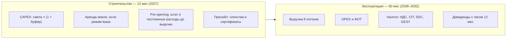
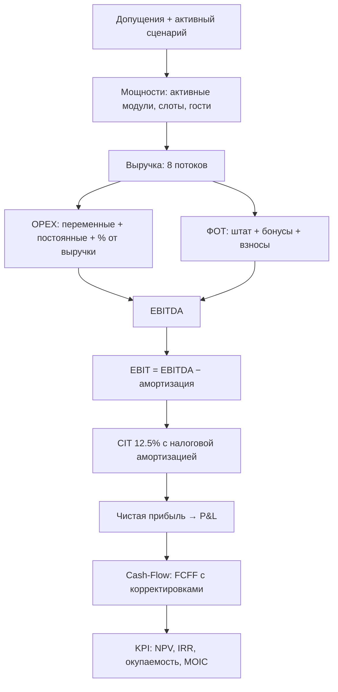
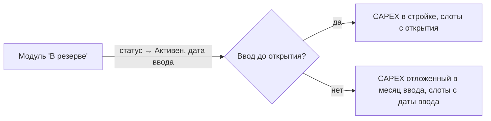
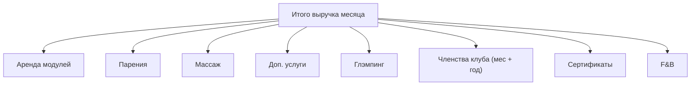
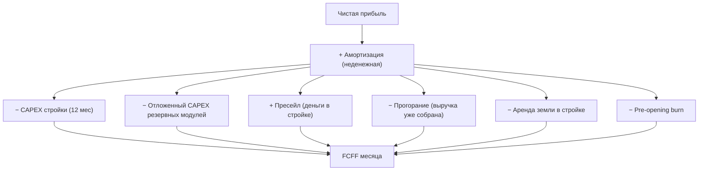

# Руководство по финансовой модели

Подробное описание принципов, допущений и формул финансовой модели
AURA HILLS — банного, SPA и глэмпинг-комплекса на Кипре.

Модель помесячная: каждая метрика посчитана для каждого из 72 месяцев
горизонта и может быть проверена на любом шаге.

## 1. Назначение модели

Модель отвечает на вопросы инвестиционного решения:

- Сколько денег нужно вложить и когда — **пиковая потребность в финансировании**;
- Когда проект вернёт деньги — **окупаемость и дисконтированная окупаемость**;
- Сколько проект заработает — **NPV, IRR, MOIC, cash-on-cash**;
- Насколько устойчив результат к ошибкам в допущениях —
  **анализ чувствительности и точка безубыточности**;
- Что будет, если спрос окажется ниже плана — **сценарии Conservative / Base / Aggressive**.

## 2. Временная структура

Горизонт — 72 месяца, разбитые на две фазы:

Все денежные потоки учитываются в том месяце, когда они происходят.
Отложенные события — пресейл, активация резервных модулей, отложенный CAPEX —
привязаны к конкретным месяцам, а не размазаны усреднённо.

## 3. Логика расчёта

Расчёт выполняется одним последовательным проходом: результат каждого шага —
вход для следующего. Такой порядок исключает циклические зависимости и делает
каждую цифру воспроизводимой.

## 4. Сценарии

### 4.1 Матрица сценариев

Три встроенных сценария задают траекторию спроса на 5 лет эксплуатации.
Каждый сценарий — это набор годовых векторов:

| Параметр | Conservative | Base | Aggressive |
|---|---|---|---|
| Загрузка бань, год 1 → 5 | 35% → 60% | 50% → 75% | 65% → 90% |
| Загрузка парений, год 1 / 3 | 35% / 65% | 50% / 85% | 65% / 95% |
| Загрузка массажа, год 1 / 3 | 20% / 45% | 30% / 65% | 45% / 80% |
| Загрузка глэмпинга, год 1 / 3 | 20% / 45% | 40% / 65% | 60% / 80% |
| Месячных членов, год 1 / 3 | 20 / 70 | 50 / 120 | 80 / 180 |
| Доля реализации услуг (uptake) | 20% | 30% | 40% |
| Рост цен в год | +3% | +3% | +5% |
| Буфер CAPEX | +15% | 0% | 0% |
| Выход на план (ramp) | 12 мес | 9 мес | 6 мес |

Загрузка услуг — отдельный вектор-множитель к доле реализации:
услуги живут в депозит-кошельке гостя и масштабируются слотами бань,
но реально берут включённую услугу не все — парения в год 1 берут
50% гостей Base-сценария, а не 100%. Вектор загрузки доп. услуг
наследуется: «парения − 25 п.п.». Переключатель «Пакетный режим»
задаёт базовую долю реализации (uptake): включён (`meta.mode` = «Да» —
текущая настройка) — услуга входит в слот и uptake = 100%; выключен —
берётся значение из строки «Доля реализации услуг». Итоговая доля
гостей с услугой = `uptake × загрузка услуги`.

### 4.2 Раскрытие в годовые векторы

Год 2 интерполируется между явно заданными первым и третьим годами
по фиксированным весам:

$$
L_{y2} = L_{y1} + (L_{y3} - L_{y1}) \times \tfrac{20}{35}
\qquad \text{(парения, массаж)}
$$

$$
L_{y2} = L_{y1} + (L_{y3} - L_{y1}) \times \tfrac{15}{25}
\qquad \text{(глэмпинг)}
$$

$$
M_{y2} = \mathrm{round}\!\left(M_{y1} + (M_{y3} - M_{y1}) \times \tfrac{30}{70}\right)
\qquad \text{(месячные члены)}
$$

Для бань год 2 — самостоятельная строка матрицы. Годы 4–5 продолжают
траекторию: парения прибавляют +5 п.п. к году 3 с потолком 100%,
массаж и глэмпинг — +5 / +10 п.п., месячные члены — ×1.25 и ×1.42
(с округлением), загрузка бань задана явно по каждому году.

## 5. Мощности и ограничения

### 5.1 Банные модули и слоты

Каждый банный модуль продаёт время: 4 слота в день — утренний, два дневных,
вечерний. Вместимость слота — гостевых мест модуля.

| Модуль | Статус | Ввод | Вместимость слота | Цены по слотам, € |
|---|---|---|---|---|
| №1 | Активен | 2028-01 | 4 гостя | 250 / 350 / 400 / 500 |
| №2 | Активен | 2028-01 | 8 гостей | 500 / 700 / 800 / 1000 |
| №3 | Активен | 2028-01 | 12 гостей | 750 / 1050 / 1200 / 1500 |
| №4–6 | В резерве | 2029-01 | 6 гостей | 375 / 525 / 600 / 750 |

Месячная ёмкость модуля в слотах:

$$S_m = 30 \times \text{слоты/день} \times \text{uptime} \times K_{load}$$

где uptime = 95% — резерв ~1.5 дня в месяц на профилактику и
межсезонное обслуживание; $K_{load}$ — помодульный коэффициент (для
дифференциации «удобных» и «менее удобных» модулей).

### 5.2 Реализованные слоты

$$s_m = S_m \times \min(1,\; L_{baths} \times \text{seas} \times \text{ramp} \times dm)$$

- $L_{baths}$ — загрузка сценария по году;
- $\text{seas}$ — сезонность месяца (ниже);
- $\text{ramp}$ — выход на план: $\min(1, (k+1)/\text{rampMonths})$;
- $dm$ — мультипликатор спроса (стресс-ручка, по умолчанию 1.0).

Загрузка ограничена 100%: при пике сезонности лишний спрос обрезается —
модель не показывает невозможную выручку.

### 5.3 Сезонность

Годовой профиль — 12 коэффициентов, среднее = 1.0.

| Месяц | Бани | Глэмпинг |
|---|---|---|
| Янв / Фев | 1.25 / 1.20 | 0.30 / 0.40 |
| Мар / Апр | 1.10 / 1.05 | 0.70 / 1.10 |
| Май / Июн | 0.90 / 0.70 | 1.20 / 1.10 |
| Июл / Авг | 1.00 / 0.65 | 0.80 / 0.80 |
| Сен / Окт | 0.90 / 1.20 | 1.10 / 1.20 |
| Ноя / Дек | 1.25 / 1.00 | 0.60 / 0.30 |

Профили противофазны: баня — зимний продукт, глэмпинг — летний.
Это сглаживает годовую выручку комплекса.

### 5.4 Резервные модули — опция роста

Резервные модули не создают выручку и не тратят CAPEX, пока их не активировать.
Активированный модуль с вводом после открытия платит свою долю помодульного
CAPEX в месяц запуска — это real option: расширение платится из операционного
потока, а не из стартовых инвестиций.

## 6. Выручка — восемь потоков

Общий множитель цен каждого потока — годовая индексация:

$$g_k = (1 + p_{growth})^{\lfloor k/12 \rfloor}$$

### 6.1 Аренда модулей

Слоты продаются по помодульному прайсу, взвешенному долями спроса на
время суток (slotMix): утро 15%, день-1 15%, день-2 30%, вечер 40%.

$$\bar{p}_m = \sum_j p_{m,j} \cdot mix_j$$

$$Rev_{rent} = \sum_m s_m \cdot \bar{p}_m \cdot g_k$$

Вечерний слот — самый дорогой и самый востребованный: микс учитывает,
что пик спроса приходится на прайм-тайм.

### 6.2 Парения

Парения продаются гостям занятых слотов: доля гостей, берущих услугу —
uptake сценария (в пакетном режиме uptake = 100% — услуга включена).

$$
Rev_{steam} = slots \times \bar{C} \times up \times L^{steam}_{y} \times
\left[(1 - w) \cdot d_{steam} \cdot \frac{w_j p_j}{\sum w_j p_j}
+ u \cdot w_j (p_j - d_{steam})\right] \times g_k
$$

- $\bar{C}$ — средняя вместимость слота;
- $up$ — effectiveUptake сценария (100% в пакетном режиме);
- $L^{steam}_{y}$ — загрузка парений сценария по году;
- $w$ = 20% — доля кошелька: часть депозита гостя, уходящая на услуги;
- $d_{steam}$ = €50 — базовая стоимость парения в депозите;
- $u$ — доля апгрейдов сверх депозита (по умолчанию 0 — консервативно);
- меню: Классика €50 (40%), Дубль €70 (30%), Афродита €150 (20%),
  Боги Олимпа €250 (10%).

### 6.3 Массаж

Формула идентична парениям — со своей загрузкой $L^{massage}_{y}$,
депозитной базой €60 и своим меню:
€60 / €100 / €150 / €200 с весами 30 / 35 / 20 / 15%.

### 6.4 Дополнительные услуги

Купели, чаны, ванны — берутся из кошелька депозита:

$$
Rev_{extra} = slots \times \bar{C} \times up \times L^{extra}_{y} \times
w_{wallet} \times d_{base} \times \frac{w_j p_j}{\sum w_j p_j} \times g_k
$$

где $L^{extra}_{y} = L^{steam}_{y} - 25$ п.п. — загрузка доп. услуг
наследует траекторию парений с дисконтом.

20% депозита €110 распределяется по семи позициям прайса пропорционально
«вес × цена». За пределы кошелька продажи не выходят — консервативно.

### 6.5 Глэмпинг

3 юнита: 2 малых по €165/ночь, 1 большой по €235. Загрузка — отдельный
сценарный вектор с летней сезонностью:

$$Rev_{glamp} = 30 \times \sum_{u} u \cdot L_{glamp} \cdot \text{seas}_{glamp} \cdot \text{ramp} \cdot price \cdot g_k$$

**OTA-канал.** 30% ночей продаётся через Booking/Airbnb с комиссией 17% —
комиссия учитывается в OPEX, а не уменьшает цену:

$$OPEX_{ota} = Rev_{glamp} \times 30\% \times 17\%$$

Установка доли в 0% — явное допущение «только прямые продажи».

### 6.6 Членства клуба

Два продукта: месячное членство €200 и годовое €1500.
Месячные члены — сценарный вектор. Годовые задаются планом активных
членов по годам — 30 / 50 / 80 / 120 / 120; каждый приносит
€1500 / 12 ≈ €125 выручки в месяц.

**Вытеснение слотов.** Члены клуба реально приходят — их визиты занимают
ёмкость до платных продаж:

$$\text{слоты}_{члены} = \frac{(\text{мес} + \text{год}) \times 2\ \text{визита/мес} \times 2\ \text{гостя}}{\bar{C}}$$

В пиковые месяцы членские слоты вытесняют платные — модель честно снижает
выручку аренды. Компенсация: гости-члены добавляются в посетителей F&B.

### 6.7 Сертификаты

Подарочные сертификаты €150, план — 65 шт/мес с рампой и мультипликатором
спроса.

### 6.8 F&B

Кафе-бар: средний чек €10 на гостя (включая гостей-членов):

$$Rev_{fb} = guests \times €10 \times g_k$$

Себестоимость продуктов 35% выручки F&B — в OPEX; повар — в штате
(условная роль, включается вместе со слоем).

### 6.9 Депозитная политика

Слот продаётся с депозитом €110 на юнит (несгораемый за юнитом). Депозит
определяет базу кошелька для услуг и апгрейдов — это не дополнительная
выручка, а механизм привязки продаж.

## 7. Пресейл и отложенная выручка

За 3 месяца до открытия запускается пресейл: сертификаты, месячные и
годовые членства года 1 по плановым ценам. Продажи дают живые деньги
в стройке, но услуга ещё не оказана — это обязательство.

В deferred-режиме деньги пресейла приходят в месяцы продаж, а выручка
«прогорает» равномерно за `presaleRecognizeMonths` = 12 месяцев после
открытия — без двойного счёта. Строка «Пул предоплат» в Cash-Flow показывает
остаток обязательства перед гостями на каждый месяц.

## 8. Земля

Три режима, переключаемые в Допущениях:

| Режим | Эффект |
|---|---|
| **У основателей** *(по умолчанию)* | Земля не покупается и не арендуется: ни CAPEX, ни аренды в OPEX — вклад основателей в проект |
| **Покупка** €80 000 | Входит в CAPEX стройки, не амортизируется, нет аренды в OPEX |
| **Аренда** €800/мес | Платится с 1-го месяца стройки; в эксплуатации — в OPEX с индексацией |

## 9. CAPEX и амортизация

### 9.1 Структура сметы

Смета в рублях по курсу из Допущений (по умолчанию 100 ₽/€). Основные блоки:

- **Модули**: банные комплексы (по числу модулей), модульные дома глэмпинга,
  печи, купели, ванны Афродиты, снежная комната;
- **Инженерия**: электрокоммуникации НЭС/ВЭС, солнечные панели, водоснабжение;
- **Проект**: дизайн-концепция, проектирование, разрешения, авторский надзор;
- **Стройка**: СМР, организация строительства, непредвиденные (12 мес), транспорт;
- **IT-слой**: сеть/WiFi/видеонаблюдение €12k, POS и железо €15k,
  кастомная разработка (букинг+CRM+учёт+сайт) €55k, внедрение €13k;
- **Наполнение**: мебель и оборудование — рассчитывается из справочника
  номенклатуры, а не константой.

Итоговый CAPEX = смета × (1 + буфер сценария): в Conservative буфер +15%.

### 9.2 Две амортизации

| Группа | Доля CAPEX | Бухг. срок | Налоговый срок |
|---|---|---|---|
| Модули и конструкции | 40% | 10 лет | 25 лет |
| Оборудование | 45% | 7 лет | 7 лет |
| Прочее | 15% | 5 лет | 5 лет |

- **Бухгалтерская** — в P&L (EBIT = EBITDA − амортизация) и обратно
  прибавляется в FCFF.
- **Налоговая** (capital allowances) — уменьшает базу CIT. Разница создаёт
  реальный налоговый щит: конструкции в налоге списываются медленнее.

Земля в режиме покупки в амортизацию не входит.

## 10. OPEX

$$\text{OPEX} = \text{переменные} + \text{постоянные} + \text{IT} + \text{аренда} + \%\text{-блок}$$

### 10.1 Переменные — по нормам расхода

Каждая статья справочника имеет норму: на слот, на гостя или на месяц.
Стоимость единицы — **landed cost**:

$$landed = price + \max(\text{доставка фикс},\; price \times \%)$$

Примеры драйверов: веники и косметика — на слот; вода/электро переменная
часть — на гостя; химия клининга — на месяц. Индексируются инфляцией.

### 10.2 Постоянные

| Статья | €/мес |
|---|---|
| Маркетинг и реклама | 5 000 |
| Электроэнергия | 3 000 |
| Страхование | 1 000 |
| Водоснабжение | 800 |
| Прочие операционные | 600 |
| Бухгалтерия / юрист | 400 |
| Отопление (газ) | 300 |
| Транспорт | 300 |
| Обслуживание модулей | 100 × активных модулей |

Все статьи индексируются инфляцией ежегодно:
$\times (1 + i)^{\lfloor k/12 \rfloor}$. Флаг «на модуль» масштабирует
статью на число активных модулей — расширение честно растит затраты.

### 10.3 IT-подписки

Отдельный включаемый слой (~€1 530/мес): хостинг €400, MSP €500,
телефония €150, SaaS €80, SMM-инструменты €100, домены €50,
резерв на комиссии €250. Индексируется инфляцией.

### 10.4 Процентный блок

| Статья | База | Ставка |
|---|---|---|
| Эквайринг | вся выручка | 2% |
| Ремонт и обслуживание | вся выручка | 3% |
| Food-cost | выручка F&B | 35% |
| OTA-комиссия | OTA-ночи глэмпинга | 17% |

## 11. Штат и фонд оплаты труда

### 11.1 Штатное расписание

| Роль | Ставок | Оклад gross, € |
|---|---|---|
| Пармастер | 6 | 1 800 |
| Массажист | 4 | 1 500 |
| Администратор | 2 | 1 200 |
| Хаусмен | 2 | 1 200 |
| Клинер | 2 | 1 050 |
| Помощник пармастера | 2 | 1 350 |
| Управляющий | 1 | 2 500 |
| Бронист | 1 | 1 320 |
| Инженер | 1 | 2 200 |

Итого 21 ставка, €32 420 окладов в месяц. Плюс условные роли:
повар €1 500 (включается с F&B) и IT-куратор €2 500 (включается с IT-слоем).

### 11.2 Полная нагрузка на ФОТ

$$\text{ФОТ} = (\text{оклады} \times i_k + \text{бонусы}) \times (1 + 15.15\%)$$

- оклады индексируются инфляцией ежегодно;
- взносы работодателя — 15.15% (соцстрах + GESY работодателя и пр.);
- бонусы, считаются от фактической выручки месяца:

$$\text{Бонусы} = 30\% \cdot Rev_{steam} + 30\% \cdot Rev_{massage} + 1\% \cdot Rev_{total}$$

Пармастеры и массажисты мотивированы долей от своих услуг, весь штат —
процентом от общей выручки.

## 12. Налоги Кипра

### 12.1 НДС

Два режима — «Гросс» (НДС внутри цены) и «С возмещением». Ставки:
19% общий, 9% глэмпинг и F&B. Входной НДС на закупки зачитывается;
кредит переносится на следующие месяцы.

### 12.2 Налог на прибыль (CIT)

$$CIT = 12.5\% \times \max(0,\; Rev - OPEX - \text{ФОТ} - \text{налоговая аморт.})$$

Убытки переносятся вперёд. Налоговая амортизация (capital allowances)
медленнее бухгалтерской по конструкциям — ранние годы платят CIT раньше,
чем «подсказывает» P&L.

### 12.3 Дивиденды, SDC и GESY

Дивиденды начисляются на чистую прибыль с **лагом 12 месяцев** —
распределяется прибыль прошлого года:

$$Div_m = ЧП_{m-12} \times (\Sigma \text{долей партнёров} + 10\%\ \text{УК})$$

Поверх дивиденд:
- **SDC 17%** — Special Defence Contribution на дивиденды резидентов;
- **GESY 2.65%** — взнос в систему здравоохранения.

Оба взвешиваются по долям резидентов: перевод партнёра в статус
«Нерезидент / Non-Dom» обнуляет оба налога по его доле. УК получает долю
без SDC/GESY; резервный фонд 10% остаётся в компании — не распределяется.

## 13. До открытия: скрытые затраты стройки

Модель честно учитывает период, когда деньги уходят, а выручки ещё нет:

- **Pre-opening** — за 2 месяца до открытия штат нанят и обучается,
  коммуналка и подписки уже платятся: оклады + взносы + постоянные +
  IT OPEX вхолостую;
- **Аренда земли** в режиме lease платится с первого месяца стройки;
- **Пресейл** частично компенсирует этот burn — деньги приходят,
  но обязательство остаётся в пуле предоплат.

Все три потока — отдельные строки Cash-Flow.

## 14. Cash-Flow и FCFF

$$\mathrm{FCFF} = \mathrm{ЧП} + \mathrm{аморт.} + \mathrm{CAPEX} + \mathrm{CAPEX}_{отл.} + \mathrm{пресейл} + \mathrm{прогорание} + \mathrm{земля} + \mathrm{preopen}$$

**Пиковая потребность** — минимум накопленного FCFF: сколько денег проект
съедает в худшей точке. Это честный ответ на вопрос «сколько нужно
инвестору».

## 15. KPI — инвестиционные метрики

| Метрика | Формула | Смысл |
|---|---|---|
| NPV | $\sum_m FCFF_m \cdot (1 + WACC/12)^{-m}$ | Стоимость проекта сверх ставки WACC |
| IRR | $(1+r_m)^{12}-1$ | Внутренняя доходность, годовая |
| Окупаемость | первый мес с накопл. FCFF > 0 | Без дисконтирования |
| Диск. окупаемость | то же по накопл. DCF | С учётом стоимости денег |
| MOIC | $\Sigma FCFF^{+} / |\Sigma FCFF^{-}|$ | Сколько евро возвращено на вложенный |
| Cash-on-cash | FCFF 3-го года / вложено | Годовая денежная отдача устаканенного года |
| Пиковая потребность | $\min$ накопл. FCFF | Размер инвестиций с запасом |
| Break-even | множитель спроса → EBITDA г.3 = 0 | Доля плана, на которой проект «в ноль» |
| NPV с TV | NPV + $\frac{FCFF_5(1+g)}{WACC-g} \cdot DF_{72}$ | Опция: терминальная стоимость по Гордону |

Terminal value по умолчанию выключена — базовые метрики консервативны и
не «дотягиваются» терминалом.

## 16. Анализ чувствительности

Вкладка Sensitivity пересчитывает всю модель в каждой точке — не экстраполяция.

### 16.1 Три матрицы

| Таблица | Оси | Метрики |
|---|---|---|
| Спрос × WACC | 0.8–1.2 × 10–20% | NPV, диск. окупаемость |
| Рост цен × буфер CAPEX | 0–7% × 0–30% | NPV, IRR |
| Уровень цен | 0.8–1.2 | NPV, IRR |

### 16.2 Tornado — главные драйверы

11 факторов пересчитываются по одному и сортируются по |ΔNPV|:
спрос ±15%, уровень цен ±10%, загрузка ±15%, CAPEX +15%/без буфера,
WACC ±3 п.п., uptime −5/+3 п.п., постоянные OPEX ±15%, оклады ±15%,
food-cost ±5 п.п., доля OTA +15 п.п./0%, инфляция ±1 п.п.

Топ-драйвер в Base — уровень цен: ±10% цены двигает NPV на ~±€0.85M.

### 16.3 Break-even

Бинарный поиск общего множителя спроса, при котором EBITDA 3-го
(устаканенного) года равна нулю. В Base — около 14% планового спроса:
сервисная маржа высокая, покрытие постоянных затрат достигается рано.

## 17. Распределение прибыли

Прибыль распределяется между тремя партнёрами, управляющей компанией и
резервным фондом:

| Участник | Доля | Примечание |
|---|---|---|
| Партнёр 1 | 26.7% | статус: резидент / non-dom — влияет на SDC+GESY |
| Партнёр 2 | 26.7% | — |
| Партнёр 3 | 26.6% | — |
| УК | 10% | дивиденды без SDC/GESY |
| Резервный фонд | 10% | остаётся в компании |

Контрольный индикатор в Допущениях следит, чтобы сумма долей + УК +
резерв всегда равнялась 100%.

## 18. Работа с приложением

- **Параметры** — все допущения редактируются; правки сохраняются в
  браузере автоматически и переживают перезагрузку. Кнопка «Сбросить»
  возвращает базовые значения.
- **Сценарии** — активный сценарий переключает всю модель; матрица
  редактируется, можно сохранять/загружать наборы.
- **Отчёты** — помесячные таблицы с итогами по годам; каждая цифра
  снабжена всплывающей формулой (значок формулы рядом со значением).
- **Спецификации и номенклатура** — справочники себестоимости услуг и
  норм расхода.
- **Документы** — этот раздел: руководства и материалы проекта.

## 19. Что модель сознательно не учитывает

Для честности картины перечислены упрощения:

- Нет кредитного финансирования — весь CAPEX считается собственным
  капиталом (FCFF-подход);
- Оборотный капитал — только через пул предоплат; дебиторка/кредиторка
  не моделируются;
- Сезонные распродажи и динамическое ценообразование не учитываются;
- НДС и CIT — по действующим ставкам без учёта льгот и налоговых каникул;
- Резервные модули при активации дают ту же экономику, что базовые —
  возможный эффект масштаба не учитывается;
- Terminal value — опциональна и выключена по умолчанию.

## 20. Глоссарий

| Термин | Значение |
|---|---|
| Слот | Один временной интервал аренды модуля (утро/день/вечер) |
| Uptake | Доля гостей слота, покупающих услугу |
| Кошелёк | Часть депозита гостя, тратимая на доп. услуги |
| Ramp | Период выхода на плановую загрузку после открытия |
| Uptime | Доля времени доступности модуля (95% = профилактика) |
| Landed cost | Цена позиции с доставкой до объекта |
| FCFF | Free Cash Flow to Firm — поток до финансирования |
| WACC | Ставка дисконтирования (14% годовых) |
| Capital allowances | Налоговая амортизация для базы CIT |
| SDC | Спец. взнос на дивиденды резидентов Кипра (17%) |
| GESY | Взнос в систему здравоохранения Кипра (2.65%) |
| Non-Dom | Налоговый статус, освобождающий от SDC на дивиденды |
| Real option | Право расшириться позже, заплатив CAPEX в момент ввода |
| Пул предоплат | Непогашенное обязательство по проданным заранее продуктам |
